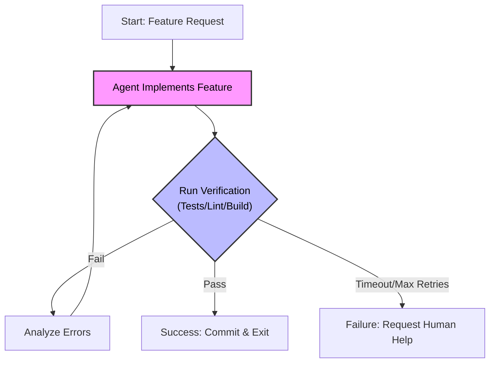

+++
title = "GenAI Agents Tricks"
weight = 2
+++

*Last updated: January 2026*

A collection of power-user tricks and best practices for getting the most out of autonomous coding agents.

---

## 🧠 Trick 1: The "Agents.md" Protocol (Distilled Context)

One of the most effective ways to align an agent with your specific project constraints and style is to maintain a high-density context file—often called `Agents.md` or `Context.md`—in your repository root.

Instead of repeating instructions in every prompt, point the agent to this file. It should contain your "Non-Negotiables".

### What to allow in your `Agents.md`

#### **Writing Code: Removing "AI Slop"**
AI models often generate defensive, verbose, or safe-but-sloppy code. Enforce these rules to keep quality high:
*   **No "AI Explanations" in Comments:** Remove extra comments that a human wouldn't add (e.g., `// loop through the array`) or that are inconsistent with the file's existing style.
*   **No Paranoid Defense:** Avoid extra try/catch blocks or null checks in internal, trusted code paths. If the data is validated at the edge, don't re-validate it deeply in internal helpers.
*   **No `any` Casts:** Do not use `as any` (TS) or equivalent to bypass type safety. Fix the type definition instead.
*   **Consistency is King:** Match the existing indentation, naming conventions, and patterns of the file you are editing.

#### **Unit Testing**
*   **Co-location:** When writing code, find or create the corresponding unit test immediately.
*   **Coverage:** Cover the new line(s) of code.
*   **Minimalism:** Tests should cover the success case and critical edge cases only. Avoid over-testing trivial logic.

#### **Logging Standards**
*   **Error vs. Info:**
    *   **ERROR** level is for system errors (5xx) where *action is required*.
    *   **INFO** or **WARN** is for expected flow issues like Access Denied (4xx) or Validation Errors.
*   **Ban `log.warn`:** Avoid `log.warn` unless strictly defined. It often becomes a graveyard of "maybe important" logs that no one checks.

---

## 🌳 Trick 2: Parallel Agents with Git Worktrees

Running multiple agents usually requires multiple folders. Copying your repo is slow and wastes disk space (`node_modules`, `.git` objects).

**The Solution: Git Worktrees**

`git worktree` allows you to have multiple branches checked out in different folders simultaneously, all sharing the same `.git` object database.

### How to use it
1.  **Create a folder** for your project (e.g., `my-app-root`).
2.  **Clone your repo** into a `main` folder inside it.
3.  **Add a worktree** for a new feature:

```bash
# Inside your main repo
git worktree add ../feature-branch-alpha -b feature/alpha
```

Now you have `../feature-branch-alpha` as a sibling folder. It shares the history and objects but has its own working directory. You can run one agent on `main` fixing bugs, and another agent on `feature-branch-alpha` building a new feature, in parallel.

**Benefits:**
*   **Disk Space:** 90% savings for large repos.
*   **Speed:** Instant creation; no re-cloning.
*   **Context:** Agents can work on independent tasks without file lock conflicts.

---

## ⚡ Trick 3: Context Economics & Navigation

Context is your most scarce resource. Treating it inefficiently leads to "lost in the middle" hallucinations and wasted cost.

*   **Context Compaction is Critical:** Never dump entire raw files if you only need signatures. Use tools that "compact" code (stripping implementations, keeping interfaces) before adding to context.
*   **Token Awareness:** Always track your `Used` vs `Remaining` tokens for every interaction. If you are 80% full, performance degrades.
*   **Semantic Search over Grep:** Don't let agents blindly `grep`. Use tools with **LSP (Language Server Protocol)** awareness or **Semantic Search** (like Cursor's codebase indexing). Agents need to follow "Go to Definition" and "Find References" chains to understand code, just like you do.

---

## 🔁 Trick 4: The "Ralph Wiggum" Loop

Named after the Simpsons character known for persistence (and occasionally accidental genius), the **Ralph Wiggum Loop** is a brute-force yet highly effective technique for autonomous agents.

### The Context
Currently, many LLM providers offer "Unlimited" or high-tier plans where they are effectively subsidizing the compute costs (burning money) to gain market share. This creates an opportunity to trade *compute time* for *human time*.

### The Trick
Instead of asking for a feature once and hoping it works, you set up a loop where the agent:
1.  Attempts to implement a feature.
2.  Runs a **strict verification suite** (tests, types, linting).
3.  If it fails, it reads the errors, adjusts, and tries again.
4.  It repeats this loop until success or a timeout.

This turns "probabilistic" generation into "deterministic" output, provided your verification specification (your tests) is solid.



### Real-world Example
I was able to build a live coding WebLLM feature using this technique.
