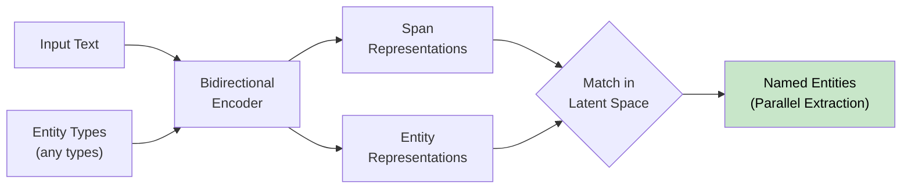
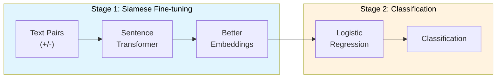

+++
title = "GenAI Architecture"
weight = 10
+++

### [ModernBERT] Modern Bidirectional Encoder

Arxiv: [https://arxiv.org/abs/2412.13663](https://arxiv.org/abs/2412.13663) _18 Dec 2024_

The paper introduces ModernBERT, a new family of encoder-only transformer models that brings modern optimizations to BERT-style architectures.

Key Features:
1. Architectural Improvements:
   - Uses GeGLU activation
   - RoPE positional embeddings
   - Alternating local-global attention
   - Native 8192 sequence length
   - Optimized for efficient inference on common GPUs
   - Full model unpadding for better efficiency

2. Training:
   - Trained on 2 trillion tokens
   - Includes code data in training mixture
   - Uses modern BPE tokenizer with 50,368 vocabulary size

3. Unique Advantages:
   - Successfully combines modern LLM architecture improvements with encoder-only models
   - Achieves better performance while maintaining high efficiency
   - Represents first major Pareto improvement over older encoders like BERT
   - Code-Aware Design: Uses a code-aware tokenizer that can properly handle programming syntax
   - The code training makes ModernBERT uniquely suited for code-related tasks while maintaining strong performance on traditional NLP tasks

Limitations:
- MLM-only objective (Masked Language Modeling)
- Not trained with RTD (Replaced Token Detection) which might hurt classification results

### [GLiNER] Generalist Model for NER using Bidirectional Transformer

Arxiv: [https://arxiv.org/abs/2311.08526](https://arxiv.org/abs/2311.08526) _14 Nov 2023_

Key Points:

Problem & Solution:
- Traditional NER models are limited to predefined entity types
- GLiNER introduces a compact model that can identify any type of entity
- Uses bidirectional transformer encoder for parallel entity extraction

Architecture:
- Uses bidirectional transformer (like BERT/DeBERTa) as backbone
- Components:
  1. Pre-trained textual encoder
  2. Span representation module
  3. Entity representation module
- Treats NER as matching entity types with text spans in latent space

Performance:
- Parallel entity extraction vs sequential generation in LLMs
- Compact design (50M-300M parameters) vs billions in LLMs
- Effective negative entity sampling during training
- Entity type dropping as regularization technique

Limitations:
- Lower performance on informal text (e.g., tweets)
- Reduced effectiveness on non-Latin scripts
- Room for improvement in low-resource languages

### [Set-Fit] Sentence Transformer Fine-tuning

Arxiv: [https://arxiv.org/abs/2209.11055](https://arxiv.org/abs/2209.11055) _22 Sep 2022_

SetFit is a two-stage framework for few-shot learning:

1. Siamese Fine-tuning Stage:
   - Takes pairs of text (positive/negative)
   - Fine-tunes Sentence Transformer in contrastive manner
   - Creates better text embeddings for target task

2. Classification Stage:
   - Uses fine-tuned embeddings from Stage 1
   - Trains simple classifier (logistic regression) on these embeddings
   - Produces final classification output

Advantages:
- No prompts or verbalizers needed
- Much smaller parameter count than PEFT/PET
- Faster training time
- Works well in multilingual settings
- Comparable accuracy to larger models