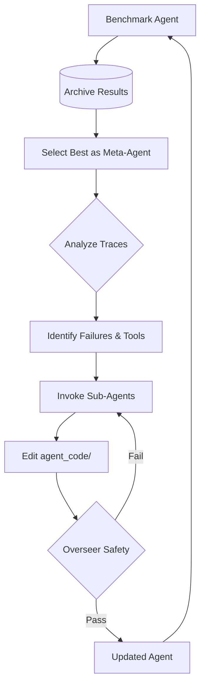
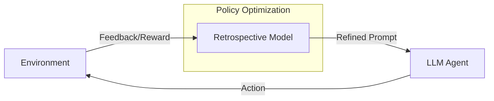

+++
title = "Agents"
weight = 1
+++

### [SICA] A Self-Improving Coding Agent

Arxiv: [https://arxiv.org/abs/2504.15228](https://arxiv.org/abs/2504.15228) _14 Apr 2024_

The Self-Improving Coding Agent (SICA) is a framework where an agent autonomously edits its own Python codebase to improve performance on benchmarks. Similar to AlphaDev's search for optimal primitives, SICA uses empirical evaluation to evolve its tools and reasoning capabilities without human intervention or gradient-based learning.

The core loop involves benchmarking the current agent (e.g., on SWE-Bench), archiving results, and selecting the best-performing version to act as a **meta-agent**.

**How Improvement Happens:**
After running benchmarks, the meta-agent analyzes the execution traces, identifying specific successes and failures. It doesn't just "guess" updates; it:
1.  **Analyzes Traces**: Investigates where the agent got stuck or failed.
2.  **Identifies Improvements**: Pinpoints needed tools, like smarter AST-based symbol locators or diff minimizers.
3.  **Invokes Sub-Agents**: Calls specialized agents (e.g., software developer, archive explorer) to propose, implement, test, and verify code changes in its own `agent_code/` directory.

**Safety and Continuity:**
To prevent the agent from getting stuck in infinite loops or unproductive paths, SICA employs an **overseer component**. This trick ensures the agent remains on track and within safety boundaries while iteratively refactoring its own logic.

Results show significant performance gains, jumping from 17% to 53% on SWE-Bench Verified subsets, demonstrating the power of autonomous, reflection-driven code updates.

### [AutoGen] Enabling Next-Gen LLM Applications via Multi-Agent Chat

Arxiv: [https://arxiv.org/abs/2308.08155](https://arxiv.org/abs/2308.08155) _3 Oct 2023 **Microsoft**_

AutoGen is an open-source framework that allows developers to build LLM applications via multiple agents that can converse with each other to accomplish tasks. The framework enables:

- Multi-agent conversations where agents can collaborate to solve complex tasks
- Customizable agent behaviors and capabilities
- Flexible agent interaction patterns
- Integration with various LLM backends
- Support for both synchronous and asynchronous communication

Key Features:
1. Conversable Agents: Agents that can engage in natural language conversations
2. Task-Oriented Dialogues: Structured conversations aimed at completing specific tasks
3. Dynamic Agent Teams: Ability to form and modify agent teams based on task requirements
4. Extensible Architecture: Easy integration of new agent types and capabilities

### [RetroFormer] Retrospective LL Agents with Policy Gradient Optimization

Arxiv: [https://arxiv.org/abs/2308.02151](https://arxiv.org/abs/2308.02151) _4 Aug 2023 **Salesforce**_

This paper introduces Retroformer, a principled framework for reinforcing language agents by learning a plug-in retrospective model, which automatically refines the language agent prompts from environment feedback through policy optimization. Specifically, our proposed agent architecture can learn from arbitrary reward information across multiple environments and tasks, for iteratively fine-tuning a pre-trained language model, which refines the language agent prompts by reflecting on failed attempts and assigning credits of actions taken by the agent on future rewards.

Key Components:
1. Retrospective Model: Learns from environment feedback to improve agent performance
2. Policy Optimization: Refines agent prompts based on reward signals
3. Credit Assignment: Analyzes the impact of actions on future rewards
4. Multi-Environment Learning: Adapts to various tasks and environments

