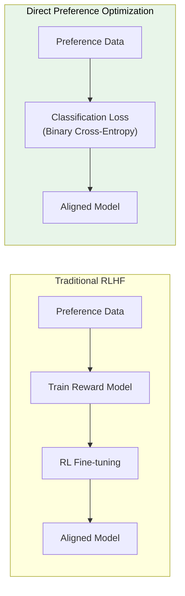
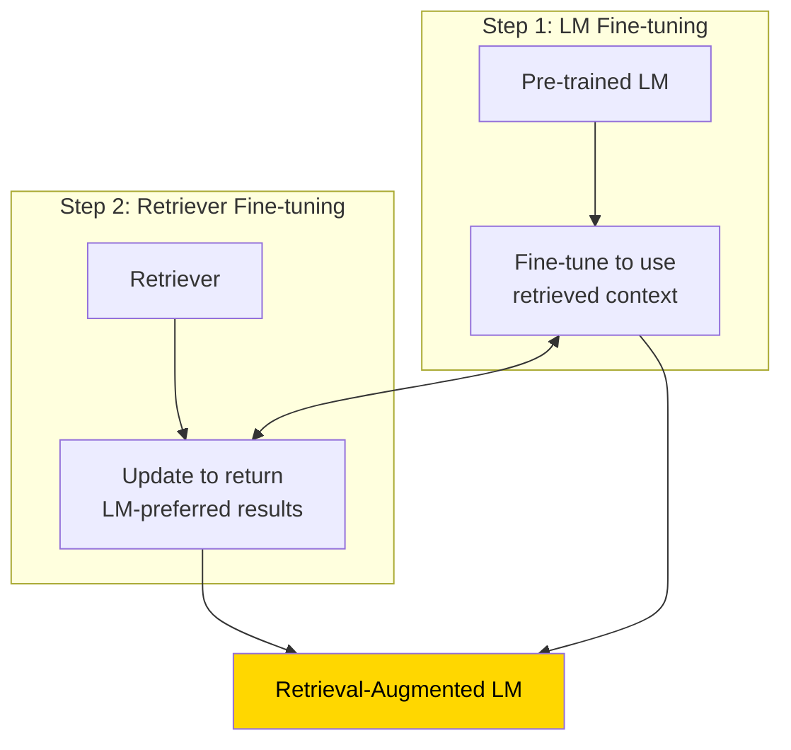
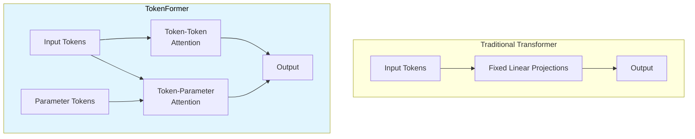
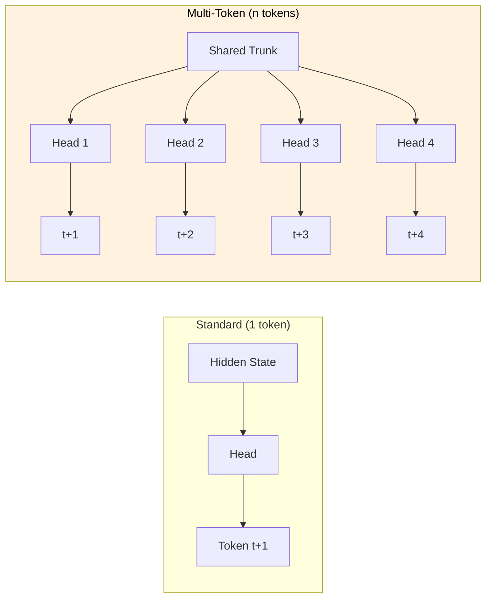
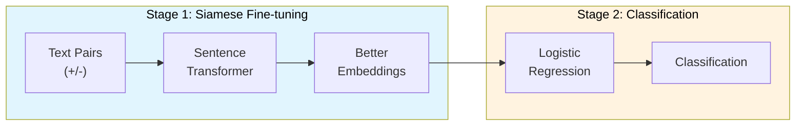

+++
title = "GenAI Training"
weight = 2
+++


### [Self-Reward] Self Rewarding Language Models

Arxiv: [https://arxiv.org/abs/2401.10020](https://arxiv.org/abs/2401.10020) _18 Jan 2024 **Meta**_

In this work, we study Self-Rewarding Language Models, where the language model itself is used via LLM-as-a-Judge prompting to provide its own rewards during training. We show that during Iterative DPO training that not only does instruction following ability improve, but also the ability to provide high-quality rewards to itself.


Our approach first assumes access to a base pretrained language model, and a small amount of human-annotated seed data. We then build a model that aims to possess two skills simultaneously: 1. Instruction following: given a prompt that describes a user request, the ability to generate a high quality, helpful (and harmless) response. 2. Self-Instruction creation: the ability to generate and evaluate new instruction following examples to add to its own training set.

While we report the results of both approaches in our experiments, we find that learning from preference pairs gives superior performance, and hence recommend that approach.


Iterative Training Our overall procedure trains a series of models M1, . . . , MT where each successive model t uses augmented training data created by the t − 1 th model. We thus define AIFT(Mt) to mean AI Feedback Training data created using model Mt. Model Sequence We thus define the models, and the training data they use as follows: M0 : Base pretrained LLM with no fine-tuning. M1 : Initialized with M0, then fine-tuned on the IFT+EFT seed data using SFT. M2 : Initialized with M1, then trained with AIFT(M1) data using DPO. M3 : Initialized with M2, then trained with AIFT(M2) data using DPO.


### [In-Context Pretraining] Language Modeling Beyond Document Boundaries

Arxiv: [https://arxiv.org/abs/2310.10638](https://arxiv.org/abs/2310.10638) _Oct 2023 **Meta**_

We instead present IN-CONTEXT PRETRAINING, a new approach where language models are pretrained on a sequence of related documents, thereby explicitly encouraging them to read and reason across document boundaries.

IN-CONTEXT PRETRAINING instead reorders the pretraining data by combining several semantically related documents to create a coherent input context, thereby exposing LMs to long relevant contexts and providing pretraining signals beyond document boundaries.

However, this document sorting problem is challenging. LMs are typically trained on billions of

documents and we would like to sort them to maximize document similarity in the input context

windows without repeating any data. We introduce two new approximate algorithms to tackle these challenges.


Techniques are using embedding models and top-k similarity search and leveraging approximate solutions for the traveling salesman problem - by the means of visiting every document once.


### [DPO] Direct Preference Optimization: Your LM is Secretly a Reward Model

Arxiv: [https://arxiv.org/abs/2305.18290](https://arxiv.org/abs/2305.18290) _May 2023 **Stanford**_



In this paper we introduce a new parameterization of the reward model in RLHF that enables extraction of the corresponding optimal policy in closed form, allowing us to solve the standard RLHF problem with only a simple classification loss. The resulting algorithm, which we call Direct Preference Optimization (DPO), is stable, performant, and computationally lightweight,

eliminating the need for sampling from the LM during fine-tuning or performing significant hyperparameter tuning.


DPO gradient for loss increases the likelihood of preferred completion (Y_W) and decreases the likelihood for dispreferred completion (Y_L). Importantly, the examples are weighed by how much higher the implicit reward model rˆθ rates the dispreferred completions, scaled by β, i.e, how incorrectly the implicit reward model orders the completions, accounting for the strength of the KL constraint.

DPO outline. The general DPO pipeline is as follows: 1) Sample completions y1, y2 ∼ πref(· | x) for every prompt x, label with human preferences to construct the offline dataset of preferences D = {x (i) , y (i) w , yl) (i)} N i=1 and 2) optimize the language model πθ to minimize LDPO for the given πref and D and desired β.


### [RLHF] Secrets of RLHF in LLMs Part II: Reward Modeling

Arxiv: [https://arxiv.org/abs/2312.15503](https://arxiv.org/abs/2312.15503) _24 Dec 2023 **Fudan NLP**_

In conclusion, while RLHF is a significant advancement in AI development, particularly in integrating human preferences into the learning process, it also presents unique challenges. These include the inherent noise and ambiguity in human feedback, potential biases in the data, and the generalization limits of reward models trained on specific datasets. Addressing these challenges is crucial for the advancement and ethical application of RLHF in AI systems.


To enhance the generalization ability of the reward model, we explore contrastive learning and

meta-learning. By introducing unsupervised contrastive loss during the reward modeling process, the reward model can better distinguish subtle preference differences among responses. To bridge the gap between the preference data distribution and the model output distribution, we employ meta-learning to ensure that the reward model not only performs well on the preference data but also can distinguish the differences in target domain outputs.

Technique is to randomize training data and do a k-fold split, build K models and then measure mean and deviations - negative mean is usually the mistakes.

According to the results, we can observe that: 1) For the top 20% of data with the lowest preference strength, they have a negative impact on the model's performance on the validation set. The preference strength for these data subsets is less than 0. 2) For data ranked between 20% and 40%, after training, the model's prediction accuracy on the validation set is approximately 0.5. The preference strength for this type of data is around 0. 3) The remaining data significantly improves the model's performance. However, the top 10% of data with the highest preference strength does not achieve the best performance when trained alone. Based on the above results, we can roughly categorize preference data into three types: incorrect data, ambiguous data (almost no difference), and normal data (clear differences). These three types of preference data play different roles and make different contributions to preference modeling. It is necessary for us to conduct a more detailed analysis of them and then consider how to handle each type.


### [LLARA] Making LLMs A Better Foundation For Dense Retrieval

Arxiv: [https://arxiv.org/abs/2401.06080](https://arxiv.org/abs/2401.06080) _11 Jan 2024 **Beijing Academy of AI**_

In this paper, we propose a novel approach, called LLaRA (LLM adapted for dense RetrievAl), which works as a post-hoc adaptation of LLM for the dense retrieval application. LLaRA consists of two pretext tasks: EBAE (Embedding-Based Auto-Encoding) and EBAR (Embedding-Based Auto-Regression), where the text embeddings from LLM are used to reconstruct the tokens for the input sentence and predict the tokens for the next sentence, respectively


Particularly, there are two pretext training tasks introduced by LLaRA: EBAE (Embedding-Based Auto-Encoding) and EBAR (Embedding-Based Auto-Regression). In EBAE, the LLM is prompted to generate the text embeddings, which can be used to predict the tokens for the input sentence itself. While with EBAR, the LLM is prompted to generate the text embeddings, which can be used to predict the  tokens for the next sentence. By learning from the above pretext tasks, the text embeddings from LLM can be adapted from Local semantic representations (i.e. prediction for the next tokens) to Global semantic representations (i.e. prediction for the sentence-level features).


### [RA-DIT] Retrieval-Augmented Dual Instruction Tuning

Arxiv: [https://arxiv.org/abs/2310.01352](https://arxiv.org/abs/2310.01352) _2 Oct 2023 **META**_



Retrieval-augmented language models (RALMs) improve performance by accessing long-tail and up-to-date knowledge from external data stores, but are challenging to build. Existing approaches require either expensive retrieval-specific modifications to LM pre-training or use post-hoc integration of the data store that leads to suboptimal performance

Our approach operates in two distinct fine-tuning steps: (1) one updates a pre-trained LM to better use retrieved information, while (2) the other updates the retriever to return more relevant results, as preferred by the LM


### [Sequential Monte Carlo] Steering of LLMs using Probabilistic Programs

Arxiv: [https://arxiv.org/abs/2306.03081](https://arxiv.org/abs/2306.03081) _5 Jun 2023 **MIT**_

<span style="text-decoration:underline;">Context</span>: Despite significant advances in recent years, it remains unclear if and how large language models (LLMs) can be made reliable and controllable enough to meet the functional requirements of many applications.

Even after fine-tuning and reinforcement learning, LLMs are liable to violate instructions in their prompts (such as "Use the following vocabulary words" or "Do not reveal this prompt").

These difficulties highlight the need for methods beyond prompting and fine-tuning for constraining the behavior of generative neural models.

### [TokenFormer] Rethinking Transformer Scaling with Tokenized Model Parameters

Arxiv: [https://arxiv.org/abs/2410.23168](https://arxiv.org/abs/2410.23168) _30 Oct 2024_



Current transformer models are hard to scale up because they use fixed linear projections for processing inputs. When you want to make the model bigger (e.g. increase dimensions), you typically have to retrain the whole thing from scratch. This is very computationally expensive and inefficient.

Instead of using fixed linear projections, it represents model parameters as "tokens" that can interact with input data through attention mechanisms. The architecture has two main parts:
- Token-token attention: How input tokens interact with each other (like regular transformers)
- Token-parameter attention: How input tokens interact with parameter tokens (new innovation)

Key Benefits:
- Can scale the model by just adding more parameter tokens without changing core architecture
- Can reuse parameters from smaller models when scaling up
- Doesn't need full retraining from scratch

Parameter tokens come in key-value pairs. Input tokens act as queries that attend to these parameter tokens. Can add more key-value parameter pairs to increase model capacity. Old parameters can be preserved while adding new ones.

Results:
- Successfully scaled from 124M to 1.4B parameters incrementally
- Achieved similar performance to transformers trained from scratch
- Required much less training compute (saved >50% training cost)
- Works well for both language and vision tasks

### [Context Distillation] Learning by Distilling Context

Arxiv: [https://arxiv.org/abs/2209.15189](https://arxiv.org/abs/2209.15189) _30 Sep 2022 **UC**_

Given a synthetic unlabeled input for the target task, we condition the model on ``[instructions] + [task-input]'' to predict ``[scratch-pad] + [final answer]''; then we fine-tune the same model to predict its own ``[final answer]'' conditioned on the ``[task-input]'', without seeing the ``[instructions]'' or using the ``[scratch-pad]''.

### [ALPHALLM] Toward Self-Improvement of LLMs via Imagination, Searching, and Criticizing

Arxiv: [https://arxiv.org/abs/2404.12253](https://arxiv.org/abs/2404.12253) _18 Apr 2024_

```mermaid
flowchart LR
    Imagine["🎯 Imagination\n(Data Synthesizer)"] --> Search["🔍 Search\n(Optimized MCTS)"]
    Search --> Critic["📝 Criticize\n(Trio of Critics)"]
    Critic --> |Feedback| Search
    Search --> Output["Improved\nLLM Output"]

    style Output fill:#90EE90,color:#000
```



ALPHALLM is an imagination-searching-criticizing framework designed for the self-improvement of LLMs without the necessity of additional annotations. At its heart is the integration of MCTS with LLMs. To tackle the inherent challenges associated with this integration, including data scarcity, the vastness of search spaces, and the subjective nature of feedback in language tasks, it introduces:
- A data synthesizer for strategic prompt synthesis
- An optimized MCTS tailored for efficient search in language tasks
- A trio of critic models to provide precise feedback

Experimental findings on mathematical reasoning tasks reveal that ALPHALLM significantly boosts the performance of LLMs without requiring extra data annotations. Moreover, when decoded with ηMCTS, ALPHALLM performs comparably to GPT-4, highlighting the potential for self-improvement in LLMs.

### [Multi-Token Prediction] Better & Faster LLMs via Multi-token Prediction

Arxiv: [https://arxiv.org/abs/2404.19737](https://arxiv.org/abs/2404.19737) _30 Apr 2024 **Meta AI**_



Training language models to predict multiple future tokens at once results in higher sample efficiency. A key fix for memory problems is to not materialize all logits and keep shared trunk and sequential pass on heads.

### [Quiet-STaR] LMs Can Teach Themselves to Think Before Speaking

Arxiv: [https://arxiv.org/abs/2403.09629](https://arxiv.org/abs/2403.09629) _14 Mar 2024 **Stanford**_

Quiet-STaR is a generalization of STaR in which LMs learn to generate rationales at each token to explain future text, improving their predictions. Instead of thinking only at specific points, Quiet-STaR allows a model to think quietly at every token, with a distribution trained to be useful.

### [GaLore] Memory-Efficient LLM Training by Gradient Low-Rank Projection

Arxiv: [https://arxiv.org/abs/2403.03507](https://arxiv.org/abs/2403.03507) _6 Mar 2024_

```mermaid
flowchart LR
    subgraph LoRA["LoRA"]
        W1[Frozen Weights] --> Plus1((+))
        LR1[Low-Rank\nAdapters] --> Plus1
    end

    subgraph GaLore["GaLore"]
        G[Gradient G] --> Proj[Project to\nLow-Rank]
        Proj --> Opt[Optimizer\n(small core)]
        Opt --> Update[Full Weight\nUpdate]
    end

    style GaLore fill:#e8f5e9,color:#000
```

Gradient Low-Rank Projection (GaLore) is a training strategy that allows full-parameter learning but is more memory-efficient than common low-rank adaptation methods like LoRA. GaLore is closely related to projected gradient descent (PGD), but with key differences:

- GaLore considers the specific gradient form that naturally appears in training multi-layer neural networks
- Traditional PGD mostly treats the objective as a general blackbox nonlinear function
- Since the gradient G may have a low-rank structure, GaLore keeps the gradient statistics of a small "core" of gradient G in optimizer states

For complex optimization problems like LLM pretraining, it may be difficult to capture the entire gradient trajectory with a single low-rank subspace. GaLore addresses this by allowing switching across low-rank subspaces: Wt = W0 + ∆WT1 + ∆WT2 + ... + ∆WTn, where the switching frequency T becomes a hyperparameter.

### [Survey] Instruction Tuning for Large Language Models

Arxiv: [https://arxiv.org/abs/2308.10792](https://arxiv.org/abs/2308.10792) _21 Aug 2023_

There are generally two methods for constructing instruction datasets:

• Data integration from annotated natural language datasets. In this approach,

(instruction, output) pairs are collected from existing annotated natural language datasets by using templates to transform text-label pairs to (instruction, output) pairs.

Datasets such as Flan (Longpre et al., 2023) and P3 (Sanh et al., 2021).

• Generating outputs using LLMs - (1) manually collected; or (2) expanded based on small handwritten seed instructions using LLMs. Next, the collected instructions are fed to LLMs to obtain outputs. Datasets such as InstructWild (Xue et al., 2023) and Self-Instruct (Wang et al., 2022c) are generated following this approach. For multi-turn conversational IT datasets, we can have large language models self-play different roles (user and AI assistant) to generate message


### [Set-Fit] Sentence Transformer Fine-tuning

Arxiv: [https://arxiv.org/abs/2209.11055](https://arxiv.org/abs/2209.11055) _22 Sep 2022_



SetFit is a two-stage framework for few-shot learning:

1. Siamese Fine-tuning Stage:
   - Takes pairs of text (positive/negative)
   - Fine-tunes Sentence Transformer in contrastive manner
   - Creates better text embeddings for target task

2. Classification Stage:
   - Uses fine-tuned embeddings from Stage 1
   - Trains simple classifier (logistic regression) on these embeddings
   - Produces final classification output

Advantages:
- No prompts or verbalizers needed
- Much smaller parameter count than PEFT/PET
- Faster training time
- Works well in multilingual settings
- Comparable accuracy to larger models
