+++
title = "GenAI Optimizations"
weight = 3
+++

### [Mixture-of-Depths] Dynamically allocating compute in transformer-based LMs

Arxiv: [https://arxiv.org/abs/2404.02258](https://arxiv.org/abs/2404.02258) _2 Apr 2024 **DeepMind**_

The benefit of the approach is the ability to set a compute budget and then based on it enforce limits - for example: enforce how many tokens can participate in block computations. Therefore, in order to avoid performance degradation the challenge becomes how to choose the right tokens for processing.

### [Offload-MoE] Fast Inference of MoE Language Models with Offloading

Arxiv: [https://arxiv.org/abs/2312.17238](https://arxiv.org/abs/2312.17238) _28 Dec 2023 **Yandex**_

We build upon parameter offloading algorithms and propose a novel strategy that accelerates offloading by taking advantage of innate properties of MoE LLM.

Technique 1: LRU Caching
- LRU is a simple strategy that doesn't consider factors like expert activation frequencies
- Keep active experts in GPU memory as a "cache" for future tokens
- If same experts are activated again, they're available instantaneously
- For simplicity, always keep k least recently used experts as cache
- If k > number of active experts, cache saves experts from multiple previous tokens
- Same number of cached experts maintained for each MoE layer

Technique 2: Speculative Loading
- Prefetch next set of experts speculatively while processing previous layer
- Guess likely next experts based on previous layer's hidden states
- If guess is correct, speeds up next layer inference
- If incorrect, can load actual next layer's experts later
- Uses next layer's gating function applied to previous layer's hidden states
- Relies on transformer layers being residual (each layer adds to previous hidden states)

### [LLM-in-a-Flash] Efficient LLM Inference with Limited Memory

Arxiv: [https://arxiv.org/abs/2312.11514](https://arxiv.org/abs/2312.11514) _12 Dec 2023 **Apple**_

Key Techniques:
1. Windowing: Strategically reduces data transfer by reusing previously activated neurons
2. Row-column bundling: Tailored to sequential data access strengths of flash memory, increases size of data chunks read from flash memory

### [RoPE] RoFormer: Enhanced Transformer with Rotary Position Embedding

Arxiv: [https://arxiv.org/abs/2104.09864](https://arxiv.org/abs/2104.09864) _20 Apr 2021 **Zhuiyi Technology Co.**_

We investigated existing approaches to relative position encoding and found they are mostly built based on adding position encoding to context representations. We introduce Rotary Position Embedding (RoPE) to leverage positional information in PLMS learning. The key idea is to encode relative position by multiplying context representations with a rotation matrix with clear theoretical interpretation.

### [Speculative] Fast Inference from Transformers via Speculative Decoding

Arxiv: [https://arxiv.org/abs/2211.17192](https://arxiv.org/abs/2211.17192) _30 Nov 2022 **Google**_

Key Observations:
- Some inference steps are "harder" and some are "easier"
- Inference from large models is often bottlenecked on memory bandwidth and communication
- Additional computation resources might be available

Solution:
- Increase concurrency as complementary approach to adaptive computation
- Accelerate inference without:
  - Changing model architectures
  - Modifying training procedures
  - Re-training models
  - Changing model output distribution
- Accomplished via speculative execution

### [GQA] Training Generalized Multi-Query Transformer Models from Multi-Head Checkpoints

Arxiv: [https://arxiv.org/abs/2305.13245](https://arxiv.org/abs/2305.13245) _22 May 2023 **Google**_

### [Multi-Heads Sharing] Fast Transformer Decoding: One Write-Head is All You Need

Arxiv: [https://arxiv.org/abs/1911.02150](https://arxiv.org/abs/1911.02150) _6 Nov 2019 **Google**_

Multi-head attention layers are a powerful alternative to RNNs for moving information across and between sequences. While training is generally fast and simple due to parallelizability, incremental inference is often slow due to memory-bandwidth costs of loading large "keys" and "values" tensors.

Solution: Multi-query attention
- Keys and values are shared across all attention "heads"
- Greatly reduces size of tensors and memory bandwidth requirements
- Much faster to decode with minor quality degradation
- Identical to multi-head attention except heads share single set of keys and values

### [MoE] Outrageously Large NN: The Sparsely-Gated MoE Layer

Arxiv: [https://arxiv.org/abs/1701.06538](https://arxiv.org/abs/1701.06538) _23 Jan 2017 **Google**_

```mermaid
flowchart LR
    Input[Input] --> Gate{Gating\nNetwork}
    Gate --> |w1| E1[Expert 1]
    Gate --> |w2| E2[Expert 2]
    Gate --> |0| E3[Expert 3...]
    Gate --> |0| EN[Expert N]
    E1 --> Combine((Σ))
    E2 --> Combine
    Combine --> Output[Output]

    style E3 fill:#eeeeee,color:#000
    style EN fill:#eeeeee,color:#000
```

Key Points:
- Neural network capacity is limited by number of parameters
- Conditional computation (parts active per-example) proposed to increase capacity
- Introduces Sparsely-Gated Mixture-of-Experts layer (MoE)
- Consists of up to thousands of feed-forward sub-networks
- Trainable gating network determines sparse combination of experts per example
- Applied convolutionally between stacked LSTM layers
- Achieves better results than state-of-the-art at lower computational cost

### [MoE] MoE Meets Instruction Tuning: A Winning Combination for LLM

Arxiv: [https://arxiv.org/abs/2305.14705](https://arxiv.org/abs/2305.14705) _24 May 2023 **Google**_

Sparse Mixture-of-Experts (MoE) is a neural architecture design that can be utilized to add learnable parameters to Large Language Models (LLMs) without increasing inference cost.
