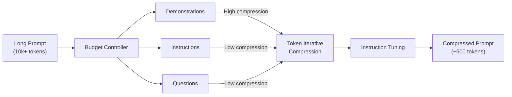
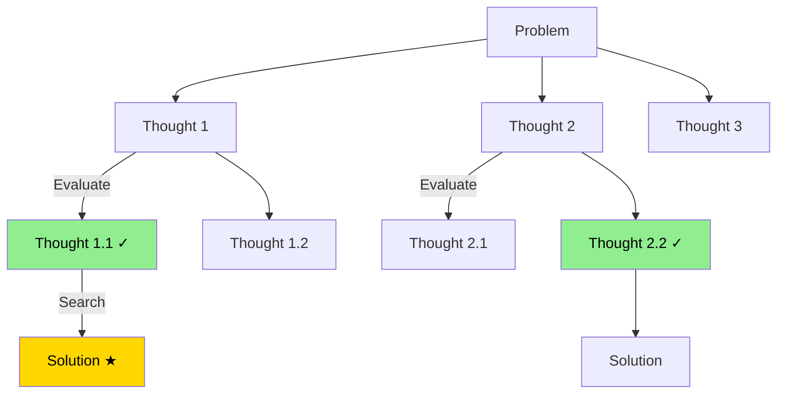
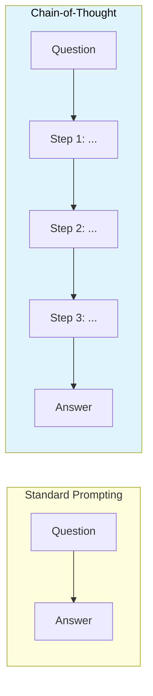
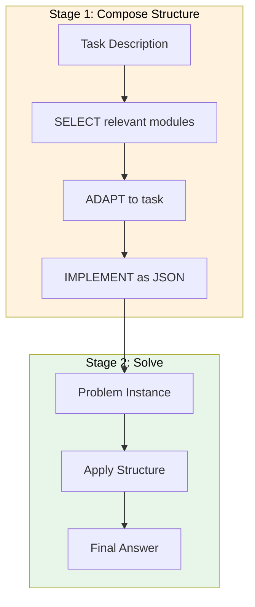
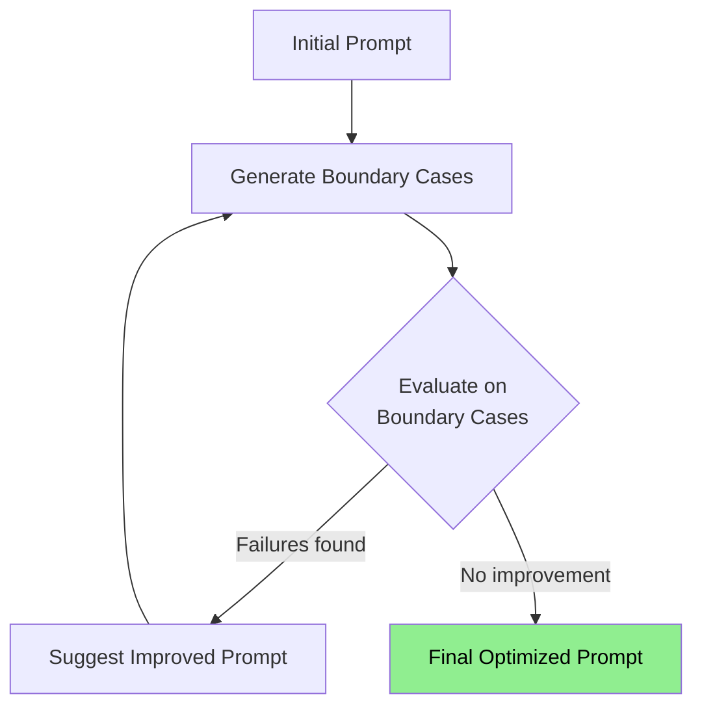
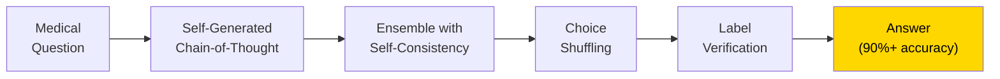
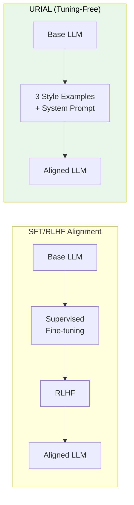
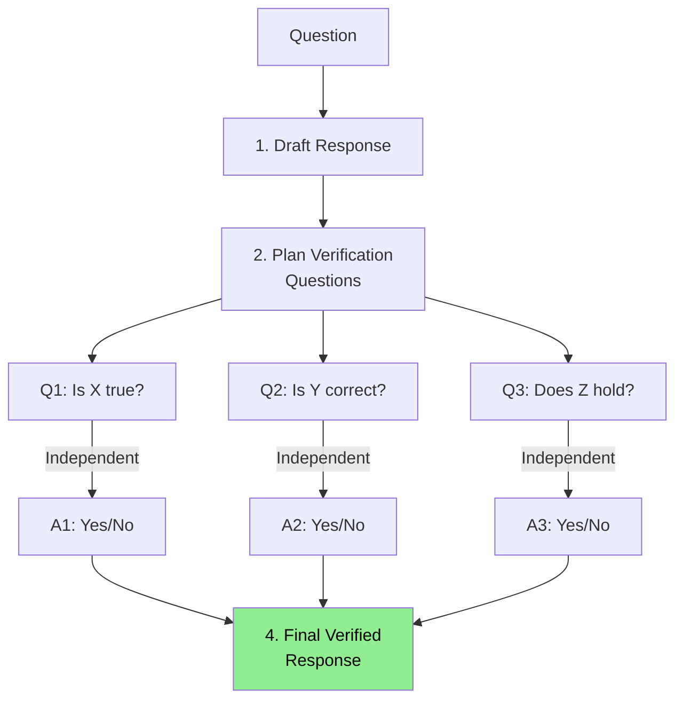

+++
title = "GenAI Prompting"
weight = 4
+++

## LLM Prompting - In-Context-Learning

### [LLMLingua] Compressing Prompts for Accelerated Inference of LLMs

Arxiv: [https://arxiv.org/abs/2310.05736](https://arxiv.org/abs/2310.05736) _Oct 2023 **Microsoft**_

Key Components:
1. Budget Controller
   - Allocates different compression ratios to prompt components
   - Prioritizes instructions and questions over demonstrations
   - Maintains semantic integrity under high compression

2. Token-level Iterative Compression
   - Divides target prompt into segments
   - Uses smaller model for perplexity distribution
   - Concatenates compressed segments for accurate probability estimation

3. Instruction Tuning
   - Aligns distribution between language models
   - Improves compression quality

### [TOT] Tree of Thoughts: Deliberate Problem Solving with LLMs

Arxiv: [https://arxiv.org/abs/2305.10601](https://arxiv.org/abs/2305.10601) _17 May 2023_

Key Features:
- Frames problems as search over a tree
- Each node represents a partial solution
- Four key components:
  1. Decomposition of intermediate process
  2. Generation of potential thoughts
  3. Heuristic evaluation of states
  4. Search algorithm selection

### [COT] Chain-of-Thought Prompting Elicits Reasoning in LLMs

Arxiv: [https://arxiv.org/abs/2201.11903](https://arxiv.org/abs/2201.11903) _Jan 2022_

Limitations:
- No guarantee of correct reasoning paths
- Manual annotation costs for few-shot setting
- Potential for both correct and incorrect answers

### [Self-Discover] LLM Self-Compose Reasoning Structures

Arxiv: [https://arxiv.org/abs/2402.03620](https://arxiv.org/abs/2402.03620) _6 Feb 2024_

Two-Stage Process:
1. Stage 1: Task-level reasoning structure
   - Uses three actions to guide LLM
   - Generates coherent reasoning structure

2. Stage 2: Instance solving
   - Follows self-discovered structure
   - Arrives at final answer

### [Intent-based Prompt Calibration] Enhancing prompt optimization with synthetic boundary cases

Arxiv: [https://arxiv.org/abs/2402.03099](https://arxiv.org/abs/2402.03099) _5 Feb 2024_

Process:
1. Start with initial prompt and task description
2. Iteratively:
   - Generate challenging boundary cases
   - Evaluate current prompt
   - Suggest improved prompt
3. Terminate when no improvement or max iterations reached

### [Text2SQL Prompting] Enhancing Few-shot Text2SQL Capabilities of LLM

Arxiv: [https://arxiv.org/abs/2311.16452](https://arxiv.org/abs/2311.16452) _Nov 2023 **Yale**_

Key Findings:
- Dual emphasis on diversity and similarity in examples
- Database knowledge augmentation benefits
- Code sequence representation for databases
- Sensitivity to number of demonstration examples

### [MedPrompt] Can Generalist FM Outcompete Special-Purpose Tuning?

Arxiv: [https://arxiv.org/abs/2311.16452](https://arxiv.org/abs/2311.16452) _28 Nov 2023 **Microsoft**_

Key Features:
- Self-generated chain-of-thought
- Ensembling with self-consistency
- Choice shuffling for bias reduction
- Label verification for hallucination mitigation

### [URIAL] Rethinking Alignment via In-Context Learning

Arxiv: [https://arxiv.org/abs/2312.01552](https://arxiv.org/abs/2312.01552) _4 Dec 2023 **Allen Institute**_

Key Points:
- Tuning-free alignment method
- Requires only three stylistic examples
- Supports Superficial Alignment Hypothesis
- Token distribution analysis shows minimal shifts

### [CoVE] Chain-of-Verification Reduces Hallucinations in LLM Models

Arxiv: [https://arxiv.org/abs/2309.11495](https://arxiv.org/abs/2309.11495) _25 Sep 2023 **Meta**_

Process:
1. Draft initial response
2. Plan verification questions
3. Answer questions independently
4. Generate final verified response
