+++
title = "GenAI Benchmarks & Evaluations"
weight = 6
+++

### [JudgeBench] A Benchmark for Evaluating LLM-based Judges

Arxiv: [https://arxiv.org/abs/2410.12784](https://arxiv.org/abs/2410.12784) _16 Oct 2024_

```mermaid
flowchart TD
    subgraph Principles["Judge Evaluation Hierarchy"]
        P1["📝 Follow Instructions"] --> P2["✅ Factual/Logical Correctness"]
        P2 --> P3["🎨 Style Preferences"]
    end

    Responses[Response Pairs] --> Judge{LLM Judge}
    Judge --> |Evaluate| Score[Preference Score]
    Score --> Benchmark{Compare to\nGround Truth}

    style P2 fill:#c8e6c9,color:#000
```

The key problem: Evaluating the reliability of LLM-based judges
The motivation: As LLMs get more advanced, we need better ways to evaluate them
The main contribution: JudgeBench, a new benchmark focused on factual/logical correctness

In this paper, we propose a hierarchical framework to analyze this problem, which contains three guiding principles that LLM-based judges should follow when selecting responses:
1. The response must faithfully follow human instructions
2. It should provide factually and logically correct answers
3. Its style should align with human preferences

As a result, human evaluations often become unreliable as the difficulty of the task increases. Scaling AI models to superhuman levels requires that AI judges evolve accordingly to accurately evaluate these increasingly complex responses.

Is verifying a problem's solution easier than solving the problem itself? Intuitively, verification should be simpler, as the model is provided with candidate solutions and only needs to identify the correct one, a task that would yield 50% accuracy through random guessing alone. Our results show that for a fixed model, the judge's accuracy closely mirrors that of the solver. While GPT-4o's and Gemini-1.5-Pro's judges slightly outperform their corresponding solvers, Claude-3.5-Sonnet's and Llama-3.1-405BInstruct's judges lag behind their respective solvers. Although the overall accuracy between the solver and judge is close, we observe a notable discrepancy in the Coding category, where the solver consistently outperforms the judge across all models. Conversely, in the Math category, judges significantly outperform solvers. This suggests that coding problems are more difficult to evaluate, while logical errors in math problems are generally easier to identify.

### [Prometheus 2] An OS LM Specialized in Evaluating Other LMs

Arxiv: [https://arxiv.org/abs/2405.01535](https://arxiv.org/abs/2405.01535) _2 May 2024_

We introduce PROMETHEUS 2 (7B & 8x7B), state-of-the-art open evaluator LMs that score high correlations with both human evaluators and proprietary LM-based judges on both direct assessment and pairwise ranking.

Training Approaches:
1. Single-Format Training: Training a base model on either direct assessment feedback dataset or pairwise ranking feedback dataset
2. Joint Training: Training a base model on both direct assessment and pairwise ranking feedback datasets
3. Weight Merging: Training two models separately and merging them with linear combination: θfinal = α × θd + (1 − α) × θp

### [PretrainingLoss] Understanding Emergent Abilities of LMs from the Loss Perspective

Arxiv: [https://arxiv.org/abs/2403.15796](https://arxiv.org/abs/2403.15796) _30 Mar 2024 **Zhipu AI**_

```mermaid
flowchart LR
    subgraph Old["Traditional View"]
        Size[Model Size] --> Perf1[Performance]
        Compute[Training Compute] --> Perf1
    end

    subgraph New["Loss Perspective"]
        Loss[Pre-training Loss] --> |Below Threshold| Emerge["✨ Emergent\nAbilities"]
        Loss --> |Above Threshold| Random["Random\nGuessing"]
    end

    style New fill:#fff3e0,color:#000
    style Emerge fill:#c8e6c9,color:#000
```

Our paper proposes a new definition of emergent abilities of language models from the perspective of pre-training loss. Empirical results show that the pre-training loss is a better metric to represent the scaling effect of language models than model size or training compute. The performance of emergent abilities exhibits emergent increase when the pre-training loss falls below a certain threshold, even when evaluated with continuous metrics.

### [PoLL] Replacing Judges with Juries: Evaluating with a Panel of Models

Arxiv: [https://arxiv.org/abs/2404.18796](https://arxiv.org/abs/2404.18796) _29 Apr 2024 **Cohere**_

```mermaid
flowchart LR
    subgraph Single["Single Judge (GPT-4)"]
        Response --> GPT4{GPT-4}
        GPT4 --> Score1[Score]
    end

    subgraph Panel["Panel of LLMs (PoLL)"]
        Response2[Response] --> M1[Model A]
        Response2 --> M2[Model B]
        Response2 --> M3[Model C]
        M1 --> Agg((Σ))
        M2 --> Agg
        M3 --> Agg
        Agg --> Score2["Aggregated\nScore"]
    end

    style Panel fill:#e8f5e9,color:#000
```

Evaluations most commonly use a single large model like GPT4. While this method has grown in popularity, it is costly, has been shown to introduce intramodal bias, and in this work, we find that very large models are often unnecessary. We propose instead to evaluate models using a Panel of LLm evaluators (PoLL).

### [Benchmark] Generating Benchmarks for Factuality Evaluation of Language Models

Arxiv: [https://arxiv.org/abs/2307.06908](https://arxiv.org/abs/2307.06908) _13 Jul 2023 **AI21 Labs**_

```mermaid
flowchart TD
    Corpus[Factual Corpus] --> Extract[Extract Facts]
    Extract --> True["✅ True Statement"]
    True --> Perturb[Perturb]
    Perturb --> F1["❌ False 1"]
    Perturb --> F2["❌ False 2"]
    Perturb --> F3["❌ False 3"]

    True --> Eval{LLM\nAssigns\nLikelihood}
    F1 --> Eval
    F2 --> Eval
    F3 --> Eval
    Eval --> |True > All False?| Score[FACTOR Score]

    style True fill:#c8e6c9,color:#000
    style Score fill:#FFD700,color:#000
```

The key idea is automatically perturbing factual statements taken from the corpus to create a constant number of false variations (hereafter, 3) for each true statement. The LM's FACTOR accuracy on our benchmark is defined as the percentage of examples for which it assigns higher likelihood to the factual completion than to any of the false variations.

