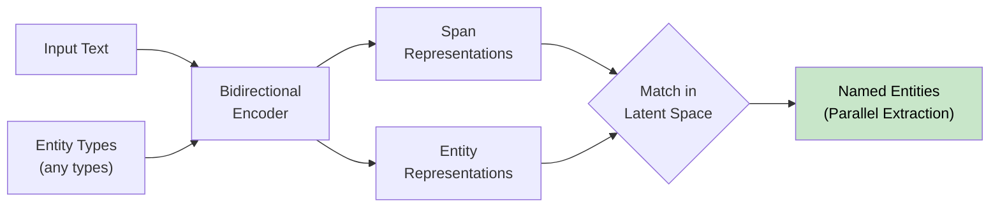

+++
title = "GenAI Models"
weight = 6
+++

### [Survey] A Survey of Reshaping the GenAI Research Landscape

Arxiv: [https://arxiv.org/abs/2312.10868](https://arxiv.org/abs/2312.10868) _18 Dec 2023  **IEEE**_

This survey explores Generative AI (AI), focusing on Mixture of Experts (MoE), multimodal learning, and the path towards Artificial General Intelligence (AGI).

## Text & Multimodal LLMs

### [Mixtral] Mixtral of Experts

Arxiv: [https://arxiv.org/abs/2401.04088](https://arxiv.org/abs/2401.04088) _8 Jan 2024 **Mixtral.ai**_

We introduce Mixtral 8x7B, a Sparse Mixture of Experts (SMoE) language model. Mixtral has the same architecture as Mistral 7B, with the difference that each layer is composed of 8 feedforward blocks (i.e. experts).

 - G denotes n dimensionality of the gating network (router), E is the expert network.

Consecutive tokens are often assigned to the same experts. In fact, we observe some degree of positional locality in The Pile datasets. Table 5 shows the proportion of consecutive tokens that get the same expert assignments per domain and layer. Figures are not showing it clearly.

### [Gemini] A Family of Highly Capable Multimodal Models

Arxiv: [https://arxiv.org/abs/2312.11805](https://arxiv.org/abs/2312.11805) _19 Dec 2023 **Google**_

The reasoning capabilities of large language models show promise toward building generalist agents that can tackle more complex multi-step problems.

### [ModernBERT] Modern Bidirectional Encoder

Arxiv: [https://arxiv.org/abs/2412.13663](https://arxiv.org/abs/2412.13663) _18 Dec 2024_

The paper introduces ModernBERT, a new family of encoder-only transformer models that brings modern optimizations to BERT-style architectures.

Key Features:
1. Architectural Improvements:
   - Uses GeGLU activation
   - RoPE positional embeddings
   - Alternating local-global attention
   - Native 8192 sequence length
   - Optimized for efficient inference on common GPUs
   - Full model unpadding for better efficiency

2. Training:
   - Trained on 2 trillion tokens
   - Includes code data in training mixture
   - Uses modern BPE tokenizer with 50,368 vocabulary size

3. Unique Advantages:
   - Successfully combines modern LLM architecture improvements with encoder-only models
   - Achieves better performance while maintaining high efficiency
   - Represents first major Pareto improvement over older encoders like BERT
   - Code-Aware Design: Uses a code-aware tokenizer that can properly handle programming syntax
   - The code training makes ModernBERT uniquely suited for code-related tasks while maintaining strong performance on traditional NLP tasks

Limitations:
- MLM-only objective (Masked Language Modeling)
- Not trained with RTD (Replaced Token Detection) which might hurt classification results

### [GLiNER] Generalist Model for NER using Bidirectional Transformer

Arxiv: [https://arxiv.org/abs/2311.08526](https://arxiv.org/abs/2311.08526) _14 Nov 2023_

Key Points:

Problem & Solution:
- Traditional NER models are limited to predefined entity types
- GLiNER introduces a compact model that can identify any type of entity
- Uses bidirectional transformer encoder for parallel entity extraction

Architecture:
- Uses bidirectional transformer (like BERT/DeBERTa) as backbone
- Components:
  1. Pre-trained textual encoder
  2. Span representation module
  3. Entity representation module
- Treats NER as matching entity types with text spans in latent space

Performance:
- Parallel entity extraction vs sequential generation in LLMs
- Compact design (50M-300M parameters) vs billions in LLMs
- Effective negative entity sampling during training
- Entity type dropping as regularization technique

Limitations:
- Lower performance on informal text (e.g., tweets)
- Reduced effectiveness on non-Latin scripts
- Room for improvement in low-resource languages

## Vision & Diffusion Models

### Training Diffusion Models with RL

Arxiv: [https://openreview.net/pdf/c6a24bc50ce18fe080ef17ee8b448a66bd060e63.pdf](https://openreview.net/pdf/c6a24bc50ce18fe080ef17ee8b448a66bd060e63.pdf) _4 Jan 2024_

1. Normalization over contrastive prompts.
2. Prompt synthesis via LLM.
3. Incorporating textual inconsistency into the score (calculate distance in embedding space) - avoid synthetically close, semantically different.

### [DPOK] RL for Fine-tuning Text-to-Image Diffusion Models

Arxiv: [https://arxiv.org/abs/2305.16381](https://arxiv.org/abs/2305.16381) _25 May 2023_

We focus on diffusion models, defining the fine-tuning task as an RL problem, and updating the pre-trained text-to-image diffusion models using policy gradients to maximize the feedback-trained reward. Our approach, coined DPOK, integrates policy optimization with KL regularization.

Generation of more data includes generating n-1 negative samples and leveraging contrastive loss and generating more images to increase diversity.

In fine-tuning the loss function will be the expectancy of the sum of all the binary-human-classified dataset and also loss from the pre-training based data (weighted with B) to maintain accuracy of the model (avoid catastrophic forgetting). For the reward loss the idea is for the reward to be log-likelihood but it’s not easy, Therefore we minimize reward-weighted MSE loss instead.

Setup: Pretrained Stable Diffusion 1.5, fine-tuning using static CLIP language encoder, Reward model is MLP using ViT-L/14 CLIP for image/text embeddings, Dataset 2700 prompts, 27k images, 16k unlabeled and 625k for pretraining.

SFT: model is updated on a fixed dataset generated by the pre-trained model.

RL: model is updated using new samples from the previously trained model during online RL fine-tuning.

Based on the results, adding KL regularization helps in improving both image fidelity and accuracy (mostly image fidelty).

### [Point-E] A System for Generating 3D Point Clouds from Complex Prompts

Arxiv: [https://arxiv.org/abs/2212.08751](https://arxiv.org/abs/2212.08751) _16 Dec 2022 **OpenAI**_

In this paper, we explore an alternative method for 3D object generation which produces 3D models in only 1-2 minutes on a single GPU. Our method first generates a single synthetic view using a text-to-image diffusion model, and then produces a 3D point cloud using a second diffusion model which conditions on the generated image. 

Using glade dataset for 2D (fine-tuned on 3D rendering).

### [CLIP] Connecting text and images

Arxiv: [https://arxiv.org/abs/2103.00020](https://arxiv.org/abs/2103.00020) _26 Feb 2021 **OpenAI**_

CLIP pre-trains an image encoder and a text encoder to predict which images were paired with which texts in our dataset. We then use this behavior to turn CLIP into a zero-shot classifier. We convert all of a dataset’s classes into captions such as “a photo of a dog” and predict the class of the caption CLIP estimates best pairs with a given image.
