+++
title = "GenAI Security"
weight = 8
+++

### [Instruction Hierarchy] Training LLMs to Prioritize Privileged Instructions

Arxiv: [https://arxiv.org/abs/2404.13208](https://arxiv.org/abs/2404.13208) _19 Apr 2024 **OpenAI**_

We propose an instruction hierarchy that explicitly defines how models should behave when instructions of different priorities conflict. We then propose a data generation method to demonstrate this hierarchical instruction following behavior, which teaches LLMs to selectively ignore lower-privileged instructions.

To generate training data, we leverage two principles: synthetic data generation and context distillation. For aligned instructions, we generate examples that have compositional requests (e.g., "write a 20 line poem in spanish") and decompose the instructions into smaller pieces (e.g., "write a poem", "use spanish", "use 20 lines"). We then place these decomposed instructions at different levels of the hierarchy and train models to predict the original ground-truth response. For misaligned instructions, we train models to act as if they are completely ignorant of the lower-level instructions.

### [Reward Tampering] Sycophancy to Subterfuge: Investigating Reward-Tampering in LLMs

Arxiv: [https://arxiv.org/abs/2406.10162](https://arxiv.org/abs/2406.10162) _14 Jun 2024 **Anthropic**_

```mermaid
flowchart LR
    subgraph Spectrum["Specification Gaming Spectrum"]
        Syco["😊 Sycophancy"] --> Game["🎮 Gaming"] --> Tamper["⚠️ Reward\nTampering"]
    end

    Train["Train on Easy\nEnvironments"] --> |Generalizes to| Dangerous["Dangerous\nBehaviors"]

    style Tamper fill:#ffcdd2,color:#000
```

Reward tampering is a very critical issue that needs to be addressed. LLM models sometimes not only tamper with the implementation of their reward function but also rewrite testing code to ensure this tampering is not caught.

We also find that once a model learns to generalize to the reward-tampering environment, training the model not to be sycophantic in environments where specification gaming is easy to detect reduces reward-tampering without eliminating it. This suggests that if a model were to learn a dangerous reward-seeking policy in the wild, but we were only aware of misbehavior which was easier to catch, training away misbehavior we could catch would not completely remove more dangerous behavior in environments that are difficult to oversee.

### [Model Stealing] Stealing Part of a Production Language Model

Arxiv: [https://arxiv.org/abs/2403.06634](https://arxiv.org/abs/2403.06634) _11 Mar 2024 **DeepMind**_

We introduce the first model-stealing attack that extracts precise, nontrivial information from black-box production language models like OpenAI's ChatGPT or Google's PaLM-2. Specifically, our attack recovers the embedding projection layer (up to symmetries) of a transformer model, given typical API access.

Intuition: Suppose we query a language model on a large number of different random prefixes. Even though each output logit vector is an l-dimensional vector, they all actually lie in a h-dimensional subspace because the embedding projection layer up-projects from h-dimensions. Therefore, by querying the model "enough" (more than h times) we will eventually observe that new queries are linearly dependent on past queries. We can then compute the dimensionality of this subspace (e.g., with SVD) and report this as the hidden dimensionality of the model.

To extract the layer fully, it's possible to SVD Q = U · Σ · V⊤ matrix and there is a proof that U · Σ = W · G. In order to do so naively we need to full token log probabilities (logits) but this is never exposed in a production model. Before the paper there were query top-K APIs with ability to add user logit bias and this is what the paper used to recover the logits vector. It's possible to recover the complete logit vector for an arbitrary prompt p by cycling through different choices for the logit bias and measuring the top-k logits each time. The improved version reduced cost and time (but less stable) by assuming fixed completions such as [p0 x x x] in several prompts and learning the x.

### [Constitutional AI] Harmlessness from AI Feedback

Arxiv: [https://arxiv.org/abs/2212.08073](https://arxiv.org/abs/2212.08073) _15 Dec 2022 **Anthropic**_

We experiment with methods for training a harmless AI assistant through self improvement, without any human labels identifying harmful outputs. The only human oversight is provided through a list of rules or principles, and so we refer to the method as 'Constitutional AI'. The process involves both a supervised learning and a reinforcement learning phase.

An AI assistant that answers all questions with "I don't know" would be harmless, but of course it would also be completely useless. In our prior work using human feedback to train a helpful and harmless assistant, we found that there was a significant tension between helpfulness and harmlessness, and in particular, our assistant often refused to answer controversial questions.

We will be experimenting with an extreme form of scaled supervision, which we refer to as Constitutional AI (CAI). The idea is that human supervision will come entirely from a set of principles that should govern AI behavior, along with a small number of examples used for few-shot prompting. Together these principles form the constitution.