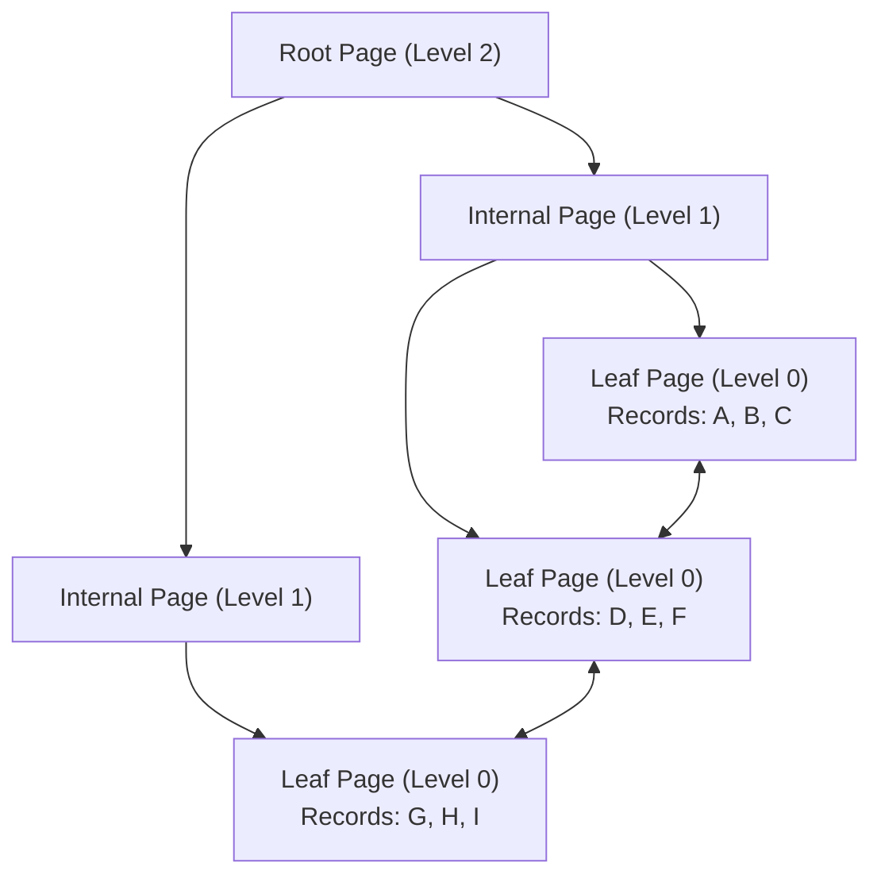
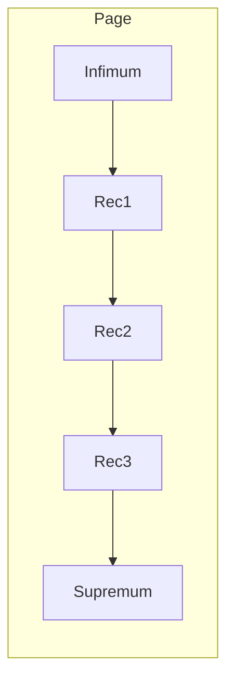

+++
title = "Data Structures"
weight = 1
+++

- [Hashtable](#hashtable)
- [Tree](#tree)
- [Graph](#graph)
- [Heap](#heap-min-max-priority-queue)
- [Basic Data Structures](#basic-data-structures)
- [Probablistic Data Structures](#probablistic-data-structures)
---

### Hashtable
Constant lookup - `O(1)` - uses hash function and list of entries for collisions.

### Tree
`Binary Tree` - Has up to 2 child nodes.

`BST (Binary Search Tree)` - Binary tree where left <= parent <= right - since BST is not balanced it has `O(N)` bound.

`AVL tree` - Balanced(self-balanced) BST, common operation is rotation/shift (L, R, LR, RL) - all balanced trees will have `O(Log(N))` bound.

`B-Tree` - A self-balancing search tree that generalizes the binary search tree, allowing nodes to have more than two children. It is designed to work well on secondary storage (disks) by minimizing the number of disk accesses.

`B+Tree` - A variation of the B-Tree (used by InnoDB) where:
- All actual data (rows) is stored **only in leaf nodes**.
- Non-leaf nodes (internal nodes) only store **keys and child page pointers**.
- Leaf nodes are linked together in a **doubly-linked list**, allowing for efficient range scans.

**Why B+Trees for Databases?**
1. **Predictable Depth**: B+Trees are very "flat." A tree with only 3 or 4 levels can store billions of rows, ensuring any record is reached in a fixed, small number of I/Os.
2. **Efficient Range Scans**: Since leaf nodes are linked, a range query (e.g., `WHERE id > 100`) just finds the first leaf and then traverses the linked list.
3. **Better Cache Performance**: Since internal nodes don't store row data, more keys fit in a single page, increasing the "fan-out" and keeping the index pages in memory longer.

#### InnoDB B+Tree Structure
In InnoDB, pages are the basic unit of storage (usually 16KB).

**Root Page & Splitting:**
The root page is special because its location is **fixed** in the InnoDB data dictionary. When the root page fills up:
1. It cannot be moved or split like a normal page.
2. Instead, its records are moved to a **newly allocated page** (the root is "raised" a level).
3. That new page is then split into two.
4. The root page remains at the same location but now contains **node pointers** to the new pages.

**Page Internals:**
- Each page has a **Header** and a **Trailer**.
- **System Records**: `Infimum` (lowest possible value) and `Supremum` (highest possible value) exist in every page and act as boundary markers for the record list.
- **Records**: Singly-linked list within the page, logically ordered by key. Physically, they take whatever space is available (no physical sorting).
- **Page Directory**: Since records are not physically sorted, InnoDB uses a "page directory" (array of pointers) to enable **binary search** within the page. It divides the records into small groups (4-8 records) and stores the offset of the last record in each group.

`Trie` (prefix tree) - Tree to locate specific keys (mostly strings by traversing individual characters). A node's position in the trie defines the key with which it is associated.

### Graph
`Adjacency matrix` - size N*M - binary value(0/1) to represent existance of an edge.

`Nodes and edges sets`

### Heap (Min / Max / Priority Queue)

| Operation | Bound | Explanation |
|------|------------|---------------------------------|
| Peak  | `O(1)` |  Read                          |
| Poll/Extract/Insert | `O(Log(N))` | It is still requires to fix the underlying tree |
| Build Heap | `O(N)` | Unlike the intuition `O(N*Log(N))` is not strict and since the tree is balanced the complexity is bound to the height ` (0 * n/2) + (1 * n/4) + (2 * n/8) + ... + (h * 1)).

### Basic Data Structures

1. Array
2. Stack
3. Queue
4. Dequeue
5. List
6. Doubly-linked List

### Probablistic Data Structures

`Bloom Filter (membership problem)` - no false negatives (always return the member), built by 2D binary array of buckets (B) * number of hash functions (L) = BxL.

`Count Min Sketch  (approximate heavy-hitters problem)` - similar to bloom filter with integer(count) array, error correlates to number of L and B size (we can’t choose epsilon = 0 since it equals to infinity memory).
