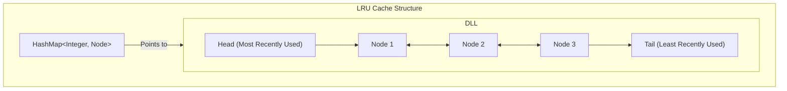

+++
title = "Problem Solving"
weight = 2
+++

- [LRU Cache - Medium - LeetCode 146](#lru-cache-medium-leetcode-146)
- [Longest Palindromic Substring - Medium - LeetCode 5](#longest-palindromic-substring-medium-leetcode-5)
- [Find Median from Data Stream - Hard - LeetCode 295](#find-median-from-data-stream-hard-leetcode-295)
- [Word Break II - Hard - LeetCode 140](#word-break-ii-hard-leetcode-140)
- [Alien Dictionary - Hard - LeetCode 269](#alien-dictionary-hard-leetcode-269)

---

### LRU Cache - Medium - [LeetCode 146](https://leetcode.com/problems/lru-cache/)

**Question**

> Design a data structure that follows the constraints of a Least Recently Used (LRU) cache.

> Implement the LRUCache class:

> LRUCache(int capacity) Initialize the LRU cache with positive size capacity.
> int get(int key) Return the value of the key if the key exists, otherwise return -1.
> void put(int key, int value) Update the value of the key if the key exists. Otherwise, add the > key-value pair to the cache. If the number of keys exceeds the capacity from this operation, > evict the least recently used key.
> The functions get and put must each run in O(1) average time complexity.

**Explanation**

LRU cache is a challenging problem, the problem is mostly focused on how to store the keys efficiently for removal by time inserted. Therefore in addition to the k/v hashtable we need an additional data-structure that allows retrieval, deletion and modification. Heap / Tree based solution are all applicable solutions but requires O(Log(N)) for insertion and removal.

In this problem it is possible to do a constant time when choosing a doubly linked list which allows to add to head and evicti from tail. It also possible to perform modification in constant (move to HEAD).

This is a java implemention of DoublyLinkedList and the LRU Cache.



**Solution**

```java
class DoublyLinkedList {
    public Node root;
    public Node tail;

    public Node addToHead(final int key) {
        if (root == null) {
            this.root = new Node(key, null, null);
            this.tail = this.root;
        } else {
            Node node = new Node(key, this.root, null);
            this.root.previous = node;
            this.root = node;
        }
        return this.root;
    }

    public void moveToHead(final Node node) throws IllegalArgumentException {
        if (this.root == null) {
            throw new RuntimeException("Invalid head state");
        }

        if (this.root == node) { // node is already head
            return;
        }

        if (this.tail == node) { // node is the tail - fix it
            this.tail = this.tail.previous;
        }

        if (node.previous != null) { // fix existing previous of node
            node.previous.next = node.next;
        }

        if (node.next != null) { // fix existing next of node
            node.next.previous = node.previous;
        }

        // set as head
        node.previous = null;
        node.next = this.root;
        this.root.previous = node;
        this.root = node;
    }

    public Node evictTail() {
        if (this.root == null) { // list is empty
            return null;
        }

        if (this.root == this.tail) {
            Node reference = this.root;
            this.root = null;
            this.tail = null;
            return reference;
        }

        Node existingTail = this.tail;
        existingTail.previous.next = null;
        this.tail = existingTail.previous;
        return existingTail;
    }
}

class LRUCache {
    final int capacity;
    int size;
    final Map<Integer, CacheEntry> cache;
    final DoublyLinkedList sortedTtlList;

    static class CacheEntry {
        public CacheEntry(int value, Node node) {
            this.value = value;
            this.node = node;
        }

        public int value;
        public Node node;
    }

    public LRUCache(int capacity) {
        this.capacity = capacity;
        this.size = 0;
        this.cache = new HashMap<>();
        this.sortedTtlList = new DoublyLinkedList();
    }

    public int get(int key) {
        if (!cache.containsKey(key)) {
            return -1;
        }

        CacheEntry entry = cache.get(key);
        sortedTtlList.moveToHead(entry.node);
        return entry.value;
    }

    public void put(int key, int value) {
        if (cache.containsKey(key)) {
            CacheEntry entry = cache.get(key);
            sortedTtlList.moveToHead(entry.node);
            entry.value = value;
        } else {
            if (this.size < this.capacity) {
                this.size = this.size + 1;
            } else {
                Node nodeToRemove = sortedTtlList.evictTail();
                cache.remove(nodeToRemove.key);
            }
            final Node newNode = sortedTtlList.addToHead(key);
            cache.put(key, new CacheEntry(value, newNode));
        }
    }
}
```

---


### Longest Palindromic Substring - Medium - [LeetCode 5](https://leetcode.com/problems/longest-palindromic-substring/)

**Question**

> Given a string s, return the longest palindromic substring in s.

```
Input: s = "babad"
Output: "bab"
Explanation: "aba" is also a valid answer.
```

**Explanation**

The simplest solution is calling isPalindrome for every substring. Checking palindrome is `O(N)` and all substrings are `O(N^2)` - therefore `O(N^3)`.

This problem can be converted to a dynamic programming problem where `Palindrome(i, j) = Palindrome(i+1, j-1) && s[i] == s[j]` (same for odd and even cases). This will require `O(N^2)` time and `O(N^2)` memory.

There is a simpler way to think about this problem. We can think about a palindrome as a center-based string and then check the palindrome from all of the centers.

**Solution**

```java
public class LongestPalindrome {
    private static class PalindromeSequence {
        public int startIndex;
        public int length;

        PalindromeSequence() {
            this.startIndex = 0;
            this.length = 1;
        }
    }

    private void checkAndUpdateLongestPalindrome(String s, int leftIndex, int rightIndex, PalindromeSequence maxPalindrome) {
        while (leftIndex >= 0 && rightIndex < s.length() && s.charAt(leftIndex) == s.charAt(rightIndex)) {
            leftIndex -= 1;
            rightIndex += 1;
        }

        int existingLength = rightIndex - leftIndex - 1;
        if (existingLength > maxPalindrome.length) {
            maxPalindrome.startIndex = leftIndex + 1;
            maxPalindrome.length = existingLength;
        }
    }

    public String longestPalindrome(String s) {
        PalindromeSequence maxPalindrome = new PalindromeSequence();

        for (int i = 0; i < s.length(); i++) {
            int rightIndex = i;
            int leftIndex = i - 1;
            checkAndUpdateLongestPalindrome(s, leftIndex, rightIndex, maxPalindrome);

            leftIndex = i - 1;
            rightIndex = i + 1;
            checkAndUpdateLongestPalindrome(s, leftIndex, rightIndex, maxPalindrome);
        }

        return s.substring(maxPalindrome.startIndex, maxPalindrome.startIndex + maxPalindrome.length);
    }
}
```

Dynamic programming alternative for reference

```java
public class LongestPalindromeDynamicProgramming {
    public String longestPalindrome(String s) {
        int strLength = s.length();
        int maxLength = 0;
        int maxStartIndex = 0;

        boolean[][] dp = new boolean[strLength][strLength];
        for (int i = strLength - 1; i >= 0; i--) {
            for (int j = i; j < strLength; j++) {
                dp[i][j] = s.charAt(i) == s.charAt(j) && (j - i < 2 || dp[i+1][j-1]);
                int existingLength = j - i + 1;
                if (dp[i][j] && existingLength > maxLength) {
                    maxStartIndex = i;
                    maxLength = j - i + 1;
                }
            }
        }
        return s.substring(maxStartIndex, maxStartIndex + maxLength);
    }
}
```

---

### Find Median from Data Stream - Hard - [LeetCode 295](https://leetcode.com/problems/find-median-from-data-stream/)

**Question**

> The median is the middle value in an ordered integer list.
>
> If the size of the list is even, there is no middle value and the median is the mean of the two middle values.
>
> Implement the `MedianFinder` class:
>
> `MedianFinder()` initializes the object.
> `void addNum(int num)` adds the integer `num` from the data stream to the data structure.
> `double findMedian()` returns the median of all elements so far.

**Explanation**

The standard solution is using two heaps:

1. Max-heap (`low`) stores the smaller half.
2. Min-heap (`high`) stores the larger half.

Invariants:

1. `low.size()` is either equal to `high.size()` or exactly one larger.
2. Every element in `low` is `<=` every element in `high`.

Why median lookup is simple:

1. Odd number of elements: `low` has one extra item, so median is `low.peek()`.
2. Even number of elements: heaps are same size, so median is average of `low.peek()` and `high.peek()`.

This is why `findMedian()` is `O(1)` after maintaining heap balance on every insert.

This approach naturally handles duplicates and negative numbers because heap ordering is value-based.

**Solution**

```java
import java.util.Collections;
import java.util.PriorityQueue;

class MedianFinder {
    // Max-heap for lower half
    private final PriorityQueue<Integer> low;
    // Min-heap for upper half
    private final PriorityQueue<Integer> high;

    public MedianFinder() {
        this.low = new PriorityQueue<>(Collections.reverseOrder());
        this.high = new PriorityQueue<>();
    }

    public void addNum(int num) {
        low.offer(num);
        high.offer(low.poll());

        // Keep low >= high and size difference at most 1
        if (high.size() > low.size()) {
            low.offer(high.poll());
        }
    }

    public double findMedian() {
        if (low.size() > high.size()) {
            return low.peek();
        }

        return (low.peek() + high.peek()) / 2.0;
    }
}
```

**Complexity**

- `addNum`: `O(log N)`
- `findMedian`: `O(1)`
- Space: `O(N)`

**Follow-ups**

1. Duplicates: no special handling needed.
2. Negative numbers: no special handling needed.
3. Space optimization: exact median over unbounded stream requires `O(N)` memory; for bounded memory use streaming quantile sketches (e.g., t-digest/KLL), which are similar to online k-means style weighted-centroid compression of 1D values.

---

### Word Break II - Hard - [LeetCode 140](https://leetcode.com/problems/word-break-ii/)

**Question**

> Given a string `s` and a dictionary of strings `wordDict`, add spaces in `s` to construct all possible sentences where each word is in `wordDict`.
>
> Return all such possible sentences in any order.

**Explanation**

The standard approach is `DP + backtracking (memoized DFS)`.

1. DFS tries every valid dictionary word starting at index `i`.
2. Memoization stores all sentence suffixes from `i` to avoid repeated work.
3. Backtracking builds full sentences by combining current word with suffix sentences.

Without memoization this can explode with repeated subproblems.

**Solution**

```java
import java.util.ArrayList;
import java.util.HashMap;
import java.util.HashSet;
import java.util.List;
import java.util.Map;
import java.util.Set;

class WordBreakII {
    public List<String> wordBreak(String s, List<String> wordDict) {
        Set<String> dict = new HashSet<>(wordDict);
        Map<Integer, List<String>> memo = new HashMap<>();
        return dfs(s, 0, dict, memo);
    }

    private List<String> dfs(String s, int start, Set<String> dict, Map<Integer, List<String>> memo) {
        if (memo.containsKey(start)) {
            return memo.get(start);
        }

        List<String> result = new ArrayList<>();
        if (start == s.length()) {
            result.add("");
            memo.put(start, result);
            return result;
        }

        for (int end = start + 1; end <= s.length(); end++) {
            String word = s.substring(start, end);
            if (!dict.contains(word)) {
                continue;
            }

            List<String> suffixes = dfs(s, end, dict, memo);
            for (String suffix : suffixes) {
                if (suffix.isEmpty()) {
                    result.add(word);
                } else {
                    result.add(word + " " + suffix);
                }
            }
        }

        memo.put(start, result);
        return result;
    }
}
```

**Follow-ups**

1. Time/space: output-sensitive; worst case is exponential due to number of valid sentences.
2. Optimization: pre-check with Word Break I boolean DP to fail fast when no solution exists.
3. Edge cases: empty input, duplicate dictionary entries, and very long strings with dense prefixes.

---

### Alien Dictionary - Hard - [LeetCode 269](https://leetcode.com/problems/alien-dictionary/)

**Question**

> There is a new alien language that uses the English alphabet, but the order of letters is unknown.
>
> Given a list of words sorted lexicographically in this alien language, derive a possible order of letters.
>
> Return `\"\"` if the input is invalid or contains a cycle.

**Explanation**

Model characters as a graph:

1. Compare adjacent words to find first differing character, which creates a directed edge `u -> v`.
2. Build indegree counts for each character.
3. Run topological sort (Kahn's algorithm).
4. If processed character count is smaller than total unique characters, a cycle exists.

Important invalid case: prefix conflict (for example `\"abc\"` before `\"ab\"`).

**Solution**

```java
import java.util.ArrayDeque;
import java.util.ArrayList;
import java.util.HashMap;
import java.util.HashSet;
import java.util.List;
import java.util.Map;
import java.util.Queue;
import java.util.Set;

class AlienDictionary {
    public String alienOrder(String[] words) {
        Map<Character, Set<Character>> graph = new HashMap<>();
        Map<Character, Integer> indegree = new HashMap<>();

        for (String word : words) {
            for (char c : word.toCharArray()) {
                graph.putIfAbsent(c, new HashSet<>());
                indegree.putIfAbsent(c, 0);
            }
        }

        for (int i = 0; i < words.length - 1; i++) {
            String first = words[i];
            String second = words[i + 1];

            if (first.length() > second.length() && first.startsWith(second)) {
                return "";
            }

            int minLen = Math.min(first.length(), second.length());
            for (int j = 0; j < minLen; j++) {
                char from = first.charAt(j);
                char to = second.charAt(j);
                if (from != to) {
                    if (!graph.get(from).contains(to)) {
                        graph.get(from).add(to);
                        indegree.put(to, indegree.get(to) + 1);
                    }
                    break;
                }
            }
        }

        Queue<Character> queue = new ArrayDeque<>();
        for (char c : indegree.keySet()) {
            if (indegree.get(c) == 0) {
                queue.offer(c);
            }
        }

        StringBuilder order = new StringBuilder();
        while (!queue.isEmpty()) {
            char current = queue.poll();
            order.append(current);

            for (char next : graph.get(current)) {
                indegree.put(next, indegree.get(next) - 1);
                if (indegree.get(next) == 0) {
                    queue.offer(next);
                }
            }
        }

        if (order.length() != indegree.size()) {
            return "";
        }

        return order.toString();
    }
}
```

**Follow-ups**

1. Complexity: `O(C + E)` where `C` is unique chars and `E` is precedence edges.
2. Invalid input checks: prefix rule and cycle detection are required.
3. If multiple valid orders exist, returning any valid topological ordering is acceptable.
