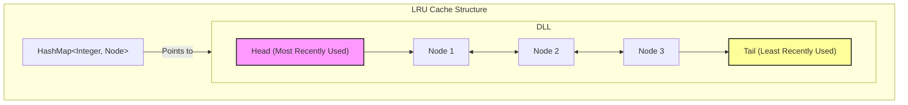

+++
title = "Problem Solving"
weight = 2
+++

- [LRU Cache - Medium - LeetCode 146](#lru-cache-medium-leetcode-146)
- [Longest Palindromic Substring - Medium - LeetCode 5](#longest-palindromic-substring-medium-leetcode-5)

---

### LRU Cache - Medium - [LeetCode 146](https://leetcode.com/problems/lru-cache/)

**Question**

> Design a data structure that follows the constraints of a Least Recently Used (LRU) cache.

> Implement the LRUCache class:

> LRUCache(int capacity) Initialize the LRU cache with positive size capacity.
> int get(int key) Return the value of the key if the key exists, otherwise return -1.
> void put(int key, int value) Update the value of the key if the key exists. Otherwise, add the > key-value pair to the cache. If the number of keys exceeds the capacity from this operation, > evict the least recently used key.
> The functions get and put must each run in O(1) average time complexity.

**Explanation**

LRU cache is a challenging problem, the problem is mostly focused on how to store the keys efficiently for removal by time inserted. Therefore in addition to the k/v hashtable we need an additional data-structure that allows retrieval, deletion and modification. Heap / Tree based solution are all applicable solutions but requires O(Log(N)) for insertion and removal.

In this problem it is possible to do a constant time when choosing a doubly linked list which allows to add to head and evicti from tail. It also possible to perform modification in constant (move to HEAD).

This is a java implemention of DoublyLinkedList and the LRU Cache.



**Solution**

```java
class DoublyLinkedList {
    public Node root;
    public Node tail;

    public Node addToHead(final int key) {
        if (root == null) {
            this.root = new Node(key, null, null);
            this.tail = this.root;
        } else {
            Node node = new Node(key, this.root, null);
            this.root.previous = node;
            this.root = node;
        }
        return this.root;
    }

    public void moveToHead(final Node node) throws IllegalArgumentException {
        if (this.root == null) {
            throw new RuntimeException("Invalid head state");
        }

        if (this.root == node) { // node is already head
            return;
        }

        if (this.tail == node) { // node is the tail - fix it
            this.tail = this.tail.previous;
        }

        if (node.previous != null) { // fix existing previous of node
            node.previous.next = node.next;
        }

        if (node.next != null) { // fix existing next of node
            node.next.previous = node.previous;
        }

        // set as head
        node.previous = null;
        node.next = this.root;
        this.root.previous = node;
        this.root = node;
    }

    public Node evictTail() {
        if (this.root == null) { // list is empty
            return null;
        }

        if (this.root == this.tail) {
            Node reference = this.root;
            this.root = null;
            this.tail = null;
            return reference;
        }

        Node existingTail = this.tail;
        existingTail.previous.next = null;
        this.tail = existingTail.previous;
        return existingTail;
    }
}

class LRUCache {
    final int capacity;
    int size;
    final Map<Integer, CacheEntry> cache;
    final DoublyLinkedList sortedTtlList;

    static class CacheEntry {
        public CacheEntry(int value, Node node) {
            this.value = value;
            this.node = node;
        }

        public int value;
        public Node node;
    }

    public LRUCache(int capacity) {
        this.capacity = capacity;
        this.size = 0;
        this.cache = new HashMap<>();
        this.sortedTtlList = new DoublyLinkedList();
    }

    public int get(int key) {
        if (!cache.containsKey(key)) {
            return -1;
        }

        CacheEntry entry = cache.get(key);
        sortedTtlList.moveToHead(entry.node);
        return entry.value;
    }

    public void put(int key, int value) {
        if (cache.containsKey(key)) {
            CacheEntry entry = cache.get(key);
            sortedTtlList.moveToHead(entry.node);
            entry.value = value;
        } else {
            if (this.size < this.capacity) {
                this.size = this.size + 1;
            } else {
                Node nodeToRemove = sortedTtlList.evictTail();
                cache.remove(nodeToRemove.key);
            }
            final Node newNode = sortedTtlList.addToHead(key);
            cache.put(key, new CacheEntry(value, newNode));
        }
    }
}
```

---


### Longest Palindromic Substring - Medium - [LeetCode 5](https://leetcode.com/problems/longest-palindromic-substring/)

**Question**

> Given a string s, return the longest palindromic substring in s.

```
Input: s = "babad"
Output: "bab"
Explanation: "aba" is also a valid answer.
```

**Explanation**

The simplest solution is calling isPalindrome for every substring. Checking palindrome is `O(N)` and all substrings are `O(N^2)` - therefore `O(N^3)`.

This problem can be converted to a dynamic programming problem where `Palindrome(i, j) = Palindrome(i+1, j-1) && s[i] == s[j]` (same for odd and even cases). This will require `O(N^2)` time and `O(N^2)` memory.

There is a simpler way to think about this problem. We can think about a palindrome as a center-based string and then check the palindrome from all of the centers.

**Solution**

```java
public class LongestPalindrome {
    private static class PalindromeSequence {
        public int startIndex;
        public int length;

        PalindromeSequence() {
            this.startIndex = 0;
            this.length = 1;
        }
    }

    private void checkAndUpdateLongestPalindrome(String s, int leftIndex, int rightIndex, PalindromeSequence maxPalindrome) {
        while (leftIndex >= 0 && rightIndex < s.length() && s.charAt(leftIndex) == s.charAt(rightIndex)) {
            leftIndex -= 1;
            rightIndex += 1;
        }

        int existingLength = rightIndex - leftIndex - 1;
        if (existingLength > maxPalindrome.length) {
            maxPalindrome.startIndex = leftIndex + 1;
            maxPalindrome.length = existingLength;
        }
    }

    public String longestPalindrome(String s) {
        PalindromeSequence maxPalindrome = new PalindromeSequence();

        for (int i = 0; i < s.length(); i++) {
            int rightIndex = i;
            int leftIndex = i - 1;
            checkAndUpdateLongestPalindrome(s, leftIndex, rightIndex, maxPalindrome);

            leftIndex = i - 1;
            rightIndex = i + 1;
            checkAndUpdateLongestPalindrome(s, leftIndex, rightIndex, maxPalindrome);
        }

        return s.substring(maxPalindrome.startIndex, maxPalindrome.startIndex + maxPalindrome.length);
    }
}
```

Dynamic programming alternative for reference

```java
public class LongestPalindromeDynamicProgramming {
    public String longestPalindrome(String s) {
        int strLength = s.length();
        int maxLength = 0;
        int maxStartIndex = 0;

        boolean[][] dp = new boolean[strLength][strLength];
        for (int i = strLength - 1; i >= 0; i--) {
            for (int j = i; j < strLength; j++) {
                dp[i][j] = s.charAt(i) == s.charAt(j) && (j - i < 2 || dp[i+1][j-1]);
                int existingLength = j - i + 1;
                if (dp[i][j] && existingLength > maxLength) {
                    maxStartIndex = i;
                    maxLength = j - i + 1;
                }
            }
        }
        return s.substring(maxStartIndex, maxStartIndex + maxLength);
    }
}
```