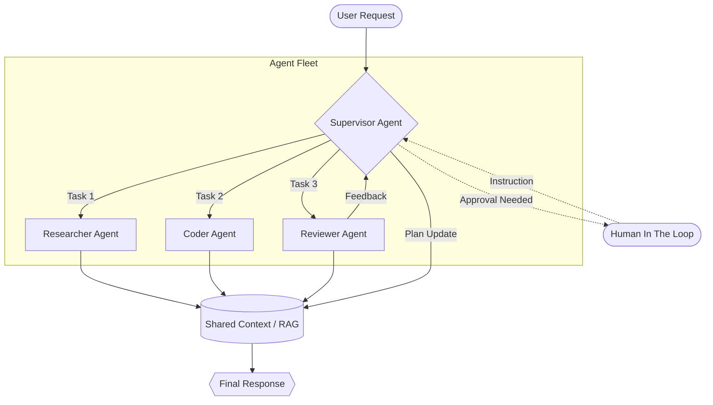

+++
title = "Agent Orchestration"
weight = 1
+++

### Design an Agent Task Orchestrator - Hard - [System Design]

**Question**

> Design a system that can orchestrate multiple specialized AI agents to solve a complex task.
> The system should support:
> 1. **Supervisor Agent**: Decomposes a large task into sub-tasks.
> 2. **Worker Agents**: Specialized agents (e.g., Coder, Researcher, Reviewer) that execute sub-tasks.
> 3. **Memory Store**: Shared context for agents to pass information.
> 4. **Human-in-the-loop**: Ability for a human to approve or steer the workflow at critical junctions.

**Explanation**

Orchestrating agents requires a clear communication protocol and state management. A common pattern is the **Supervisor/Worker** pattern where a central controller manages the lifecycle of a task.



**Key Considerations**

- **State Management**: How do we prevent agents from looping or getting stuck?
- **Token Budget**: How do we limit the cost of long-running autonomous tasks?
- **Tool Use**: How do agents decide which tool (Search, Python REPL, Database) to use?

**Sample Interface (Python)**

```python
class TaskOrchestrator:
    def __init__(self, supervisor: Agent, workers: List[Agent]):
        self.supervisor = supervisor
        self.workers = {w.name: w for w in workers}
        self.memory = SharedMemory()

    def run(self, original_task: str):
        plan = self.supervisor.decompose(original_task)
        for sub_task in plan:
            worker = self.workers[sub_task.target_agent]
            result = worker.execute(sub_task, context=self.memory.get_recent())
            self.memory.store(sub_task.id, result)

            if sub_task.requires_approval:
                self.request_human_review(sub_task, result)

        return self.supervisor.summarize(self.memory.all())
```
