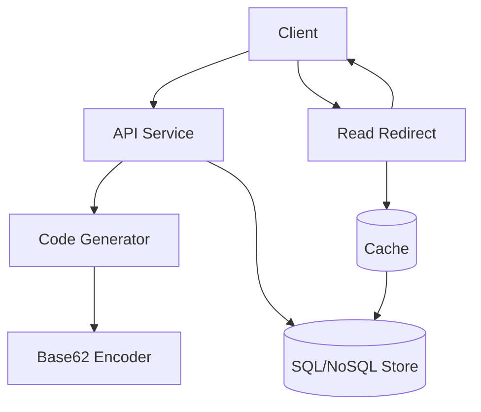

+++
title = "TinyURL"
weight = 2
+++

### On-Site Round 1 - Coding (45-60 min)

**Question**

> Design TinyURL.
>
> Constraints and discussion points:
> 1. Hashing strategy
> 2. Base62 encoding for short codes
> 3. Collision handling
> 4. Idempotent create API for retries/concurrency

**Explanation**

TinyURL validates your ability to design APIs, data models, code generation, and collision-safe write paths.
  
A strong interview answer starts with assumptions, then API/data model, then edge cases and scale.

---

### TinyURL - [System Design]

**Core API**

```text
POST /api/v1/urls
Request:  { "long_url": "https://example.com/some/very/long/path" }
Response: { "short_url": "https://t.y/Ab3xQ9", "code": "Ab3xQ9" }

GET /:code
Response: 301 redirect to original long URL
```

**Data Model**

```text
urls(
  id BIGINT PRIMARY KEY,
  code VARCHAR(8) NOT NULL,
  long_url TEXT NOT NULL,
  long_url_hash CHAR(64) NULL,
  created_at TIMESTAMP NOT NULL,
  expires_at TIMESTAMP NULL,
  user_id BIGINT NULL,
  deleted_at TIMESTAMP NULL
)

Indexes:
1. UNIQUE(code)                      -- main redirect lookup + collision protection
2. INDEX(user_id, created_at)        -- user dashboard/list queries
3. UNIQUE(user_id, long_url_hash)    -- optional idempotent create per user
4. INDEX(expires_at)                 -- optional cleanup/TTL jobs
```

**High-Level Flow**



**Collision Handling Approaches**

1. Generate candidate code, try insert with `UNIQUE(code)`, retry on conflict.
2. Salted hash + retry counter: `hash(long_url + attempt)`.
3. Deterministic ID approach: store row first, encode numeric `id` to Base62, nearly collision-free at code layer.

**Why Base62 (Napkin Math)**

Base62 uses `0-9`, `a-z`, and `A-Z`, so each character has 62 possibilities.

- 6-char code space: `62^6 = 56,800,235,584` (~56.8B)
- 7-char code space: `62^7 = 3,521,614,606,208` (~3.5T)
- 8-char code space: `62^8 = 218,340,105,584,896` (~218T)

If the system stores 500M URLs:

- 6 chars gives high occupancy and more retry pressure over time.
- 7 chars gives comfortable headroom for growth.

For interview discussion, 7-8 chars is usually a practical default (depends on expected scale and TTL/expiry policy).

**Hash Collision Deep Dive**

Collisions can happen in two places:

1. Hash collision: different long URLs produce same hash output.
2. Code collision: different hash/ID inputs map to the same short code (after truncation or retries).

Mitigation strategy:

1. Keep `UNIQUE(code)` as final correctness guard.
2. On conflict, regenerate with `attempt` salt and retry (`hash(url + ":" + attempt)`).
3. Keep retry bounded, then increase code length or switch generator mode.
4. Track collision rate metric; sudden increases usually indicate entropy bugs or saturation.

Birthday paradox intuition:

- Even with a large code space, collision probability rises non-linearly as occupancy grows.
- Therefore, production systems rely on unique constraints + retries, not probability alone.

**Practical Notes**

- Use a cache for hot redirects (`code -> long_url`) to reduce read latency.
- Add rate limiting and URL validation for abuse prevention.
- Add TTL support for expiring links when needed.

**Expected Senior Follow-Up: Idempotency**

For `POST /api/v1/urls`, retries should not create duplicate short links for the same tenant and normalized long URL.

Implementation approach:

1. Normalize long URL deterministically.
2. Compute `long_url_hash` (e.g., SHA-256).
3. Enforce `UNIQUE(user_id, long_url_hash)`.
4. On unique conflict, return the existing code instead of creating a new one.

**Additional Complication Idea: Multi-Region Writes**

1. Use a global allocator (or globally unique ID scheme) so regions do not generate colliding codes.
2. Replicate `code -> long_url` mappings across regions asynchronously for low-latency local reads.
3. Global uniqueness does not imply instant cross-region visibility, so keep read-after-write mitigation (regional stickiness or origin fallback).

**Additional Complication Idea: Abuse Handling**

1. Validate/normalize URL input and enforce domain/IP/user rate limits on create APIs.
2. Run safe-browsing/phishing checks and maintain allow/block lists.
3. Keep link status (`active`, `under_review`, `blocked`) and enforce status checks during redirect.

**Additional Complication Idea: Analytics Pipeline**

1. Redirect path should stay fast: emit click events asynchronously (queue/log) and return immediately.
2. Enrich events offline/streaming (geo/device/referrer) and filter bots before aggregation.
3. Store raw events with retention policy and expose product metrics from aggregated stores.

**Additional Complication Idea: Hot Key Protection**

1. Cache hot links aggressively at CDN/edge and application cache layers.
2. Use single-flight/request coalescing + stale-while-revalidate to prevent cache stampedes.
3. Add per-key throttling/circuit breakers so viral links do not overload the origin store.

**Additional Complication Idea: Custom Aliases (Paid Business Tier)**

1. Uniqueness and race conditions: treat alias as `code`, enforce `UNIQUE(code)`, return `409 alias_taken` on conflict.
2. Plan gating and quotas: only paid tenants can use custom aliases, with per-tenant limits and create/update rate limits.
3. Brand safety and abuse: maintain reserved keywords, run profanity/phishing checks, and allow moderation flags.
4. Lifecycle policy: keep aliases immutable by default and use tombstones (e.g., 60-90 days) before reuse.
5. Namespace model: choose global alias uniqueness or tenant-scoped uniqueness (`UNIQUE(tenant_id, code)`) with branded domains.

**Additional Complication Idea: Encryption, Deletion + Expiration, GDPR**

1. Encryption: encrypt `long_url` at rest (KMS-managed keys), TLS in transit, and restrict key access by service role.
2. Soft delete vs hard delete: soft delete marks inactive immediately (`deleted_at`) so redirects stop fast; hard delete asynchronously purges data from DB, caches, replicas, and analytics stores.
3. Expiration: use `expires_at`; expired links return a terminal response (commonly `410`) and trigger cache invalidation/tombstone flow.
4. GDPR: maintain a deletion workflow with audit trail and SLA (for example, complete hard-delete propagation within policy window).
5. Reuse safety: keep minimal tombstones before code/alias reuse to prevent link hijacking after delete/expire.

**Sample Interface (Python)**

```python
import random
import string

BASE62 = string.digits + string.ascii_lowercase + string.ascii_uppercase


class TinyUrlService:
    def __init__(self, repository):
        self.repository = repository

    def _random_code(self, size=6):
        return "".join(random.choice(BASE62) for _ in range(size))

    def create_short_url(self, long_url: str) -> str:
        for _ in range(5):  # bounded retry for collision handling
            code = self._random_code()
            if self.repository.insert_if_absent(code=code, long_url=long_url):
                return code
        raise RuntimeError("could not allocate short code")

    def resolve(self, code: str) -> str | None:
        return self.repository.get_long_url(code)
```
