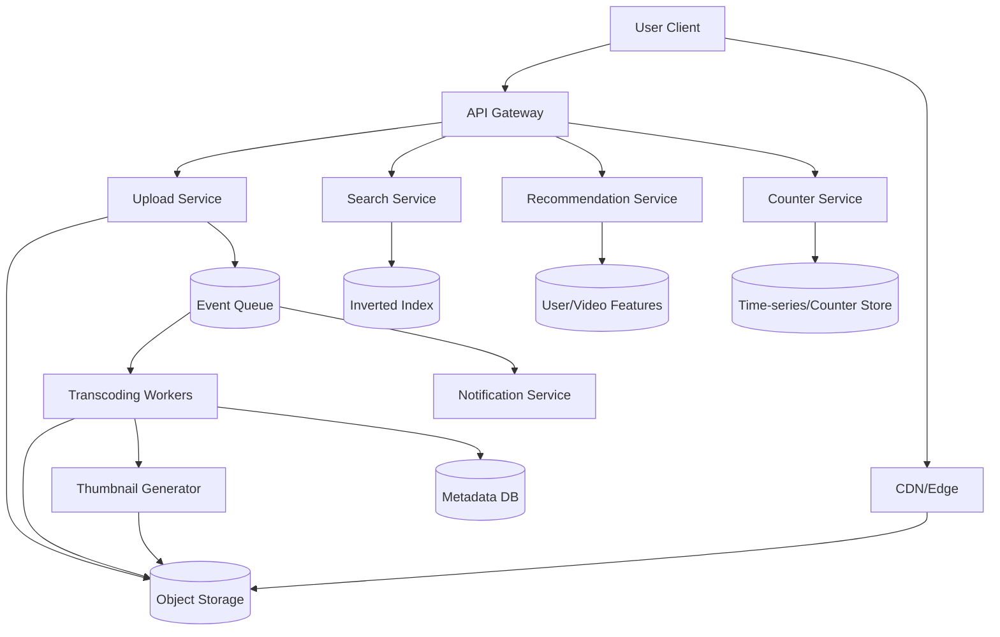

+++
title = "YouTube"
weight = 3
+++

### On-Site Round - System Design (45 min)

**Question**

> Design YouTube.
>
> Areas to cover:
> 1. Video upload/download (chunking, resumable uploads, object storage)
> 2. Recommendation (collaborative filtering + content-based)
> 3. Search (inverted index, ranking, autocomplete)
> 4. Scale (1B+ DAU, hot videos, CDN, sharding)
> 5. Consistency vs availability for view/count metrics
> 6. Transcoding pipeline, thumbnails, notifications

**Explanation**

This question tests whether you can design a large media platform end-to-end: ingest, process, serve, discover, and measure at massive scale.

A strong answer usually separates the system into five planes:

1. Ingestion plane (upload + storage)
2. Processing plane (transcoding + thumbnails + metadata)
3. Serving plane (video delivery via CDN)
4. Discovery plane (search + recommendation)
5. Analytics plane (views, engagement, counters)

---

### High-Level Architecture

### Upload / Download

**Upload**

1. Client requests upload session.
2. Upload service returns pre-signed chunk URLs.
3. Client uploads chunks with retry/resume support.
4. After final commit, service emits `video_uploaded` event.

**Download/Playback**

1. Player fetches manifest (HLS/DASH).
2. Segments served from CDN edge cache.
3. CDN misses pull from origin object storage.

This design minimizes origin pressure and handles hot videos well.

### Transcoding Pipeline

1. `video_uploaded` event triggers async transcoding.
2. Generate multiple resolutions/bitrates (240p..4K).
3. Create streaming manifests and thumbnails.
4. Persist metadata (`status=ready`) and publish notification event.

Failure handling:

- Idempotent jobs keyed by `video_id + profile`.
- Dead-letter queue for poison tasks.
- Partial success allowed (serve lower resolutions if high profile fails).

### Search Design

1. Index title, tags, channel, and transcript tokens into inverted index.
2. Ranking combines lexical relevance + freshness + engagement priors.
3. Autocomplete uses prefix index + trending query boosts.

Read path must be low latency; indexing can be eventually consistent.

### Recommendation Design

Two-stage approach:

1. Candidate generation:
   - collaborative filtering (similar users/videos)
   - content-based signals (topic, embeddings, language)
2. Ranking:
   - model combines watch history, retention, CTR, recency, diversity

Serving strategy:

- Precompute candidate pools for active users.
- Online rank top-N with fresh context.

### Scale (1B+ DAU)

1. Store immutable media in object storage; shard metadata by `video_id`.
2. Aggressive CDN for hot videos; multi-layer cache for manifests/metadata.
3. Partition queues and processing workers by region/video class.
4. Separate control-plane APIs from heavy data-plane traffic.
GenAI assist: classify likely-to-trend videos early and pre-warm CDN/cache tiers before traffic spikes.

### Consistency vs Availability (Views / Counts)

Use split semantics:

1. View ingestion path: highly available append (event log).
2. Public counters: eventually consistent aggregates (near-real-time).
3. Creator analytics: corrected/anti-fraud batch numbers.

This keeps playback and event capture available while accepting slight lag in displayed counts.

### Notifications

Trigger async fanout when:

1. Channel publishes video and notification policy allows.
2. Video reaches `ready` state.
3. Notification service applies user preferences and rate limits.

### Additional Complication Idea: Copyright Detection

1. Compute audio/video fingerprints at upload time and compare against rights-holder reference sets.
2. Block, monetize, or allow with policy based on match confidence and territory/license rules.
3. Re-scan catalog periodically as reference databases and policies evolve.
GenAI assist: use multimodal embeddings to catch transformed near-duplicates that exact fingerprinting can miss.

### Additional Complication Idea: Abuse, Spam, and Safety

1. Run ML + rules moderation on title/description/transcript/thumbnails pre and post publish.
2. Keep trust/risk scores per account and apply rate limits, temporary holds, or stricter review.
3. Maintain human-review queues for borderline/high-impact enforcement decisions.
GenAI assist: use LLM/VLM classifiers to generate richer policy labels and reviewer-ready rationale across text, audio, and images.

### Additional Complication Idea: Multi-Region Failover

1. Use active-active playback with global DNS/load balancing and regional CDNs.
2. Keep upload sessions region-local, with cross-region replication and resumable continuation on failover.
3. Replicate metadata asynchronously and use regional stickiness/origin fallback for read-after-write gaps.
GenAI assist: use an incident copilot to summarize telemetry and suggest failover/rollback runbook steps to operators.

### Additional Complication Idea: Retention, Privacy, and GDPR

1. Separate PII from high-volume event data; apply field-level encryption and strict access controls.
2. Support delete/export workflows for watch history and user data with auditable completion state.
3. Enforce retention windows and downstream deletion propagation to analytics, caches, and backups per policy.
GenAI assist: use entity extraction to auto-detect and classify PII in user-generated content for policy routing.
